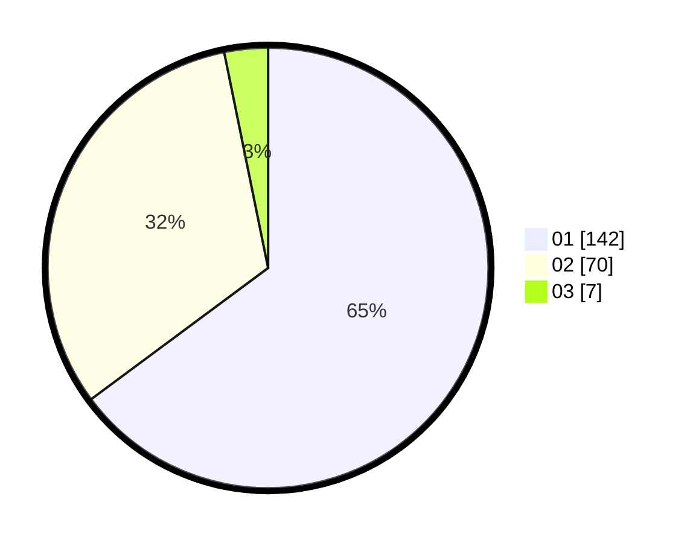

# Hasil

Hasil perolehan suara paslon dapat dilihat pada file paslon-01.txt, paslon-02.txt, dan paslon-03.txt.

Jika tidak ada, artinya data tersebut belum ada pada SIREKAP.

## Perolehan Suara

 * Paslon 01: **142**.
 * Paslon 02: **70**.
 * Paslon 03: **7**.

## Foto C Plano

https://sirekap-obj-formc.kpu.go.id/490b/pemilu/ppwp/31/73/05/10/02/3173051002057-20240215-034553--68cfb79a-5a17-4919-a47d-7a546a8f3fa9.jpg

https://sirekap-obj-formc.kpu.go.id/490b/pemilu/ppwp/31/73/05/10/02/3173051002057-20240215-034812--b5daa3a8-0a3f-420c-b2a6-e2d5f2799d95.jpg

https://sirekap-obj-formc.kpu.go.id/490b/pemilu/ppwp/31/73/05/10/02/3173051002057-20240215-035009--fbdfda79-5396-4026-8c3d-b99a1889c55d.jpg
