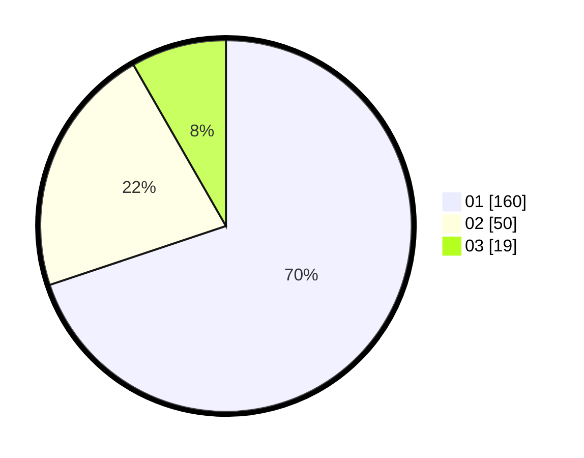

# Hasil

Hasil perolehan suara paslon dapat dilihat pada file paslon-01.txt, paslon-02.txt, dan paslon-03.txt.

Jika tidak ada, artinya data tersebut belum ada pada SIREKAP.

## Perolehan Suara

 * Paslon 01: **160**.
 * Paslon 02: **50**.
 * Paslon 03: **19**.

## Foto C Plano

https://sirekap-obj-formc.kpu.go.id/0c24/pemilu/ppwp/31/73/05/10/02/3173051002061-20240215-191115--04aa4c5d-c0bd-4ffb-a2e9-01790ed05f5c.jpg

https://sirekap-obj-formc.kpu.go.id/0c24/pemilu/ppwp/31/73/05/10/02/3173051002061-20240215-191214--2cbff2fa-bff5-4706-9a1b-b19c5e5729a5.jpg
