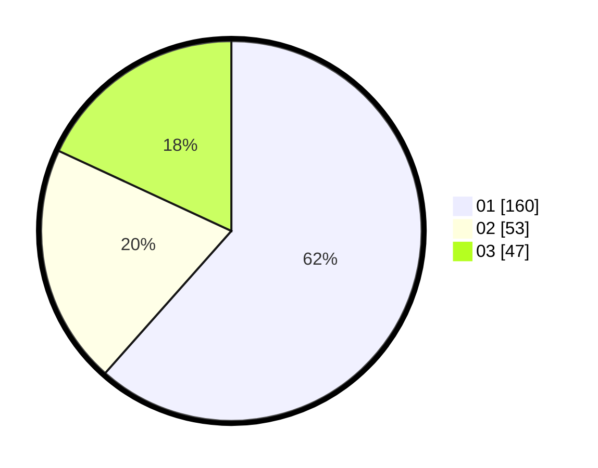

# Hasil

Hasil perolehan suara paslon dapat dilihat pada file paslon-01.txt, paslon-02.txt, dan paslon-03.txt.

Jika tidak ada, artinya data tersebut belum ada pada SIREKAP.

## Perolehan Suara

 * Paslon 01: **160**.
 * Paslon 02: **53**.
 * Paslon 03: **47**.

## Foto C Plano

https://sirekap-obj-formc.kpu.go.id/bbd1/pemilu/ppwp/31/73/05/10/02/3173051002065-20240215-093929--573124eb-4406-49eb-ae0a-4940c947d3e4.jpg

https://sirekap-obj-formc.kpu.go.id/bbd1/pemilu/ppwp/31/73/05/10/02/3173051002065-20240214-192346--5dbe5e45-962c-4e90-87c8-15fd512973c3.jpg

https://sirekap-obj-formc.kpu.go.id/bbd1/pemilu/ppwp/31/73/05/10/02/3173051002065-20240214-192817--8ea20365-01c1-4c0e-8393-4babb0b37510.jpg
