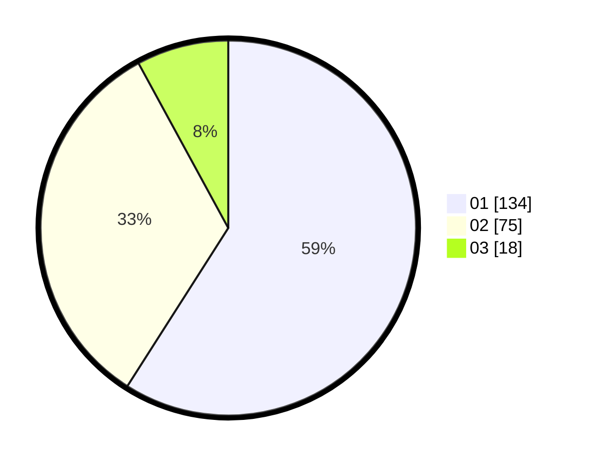

# Hasil

Hasil perolehan suara paslon dapat dilihat pada file paslon-01.txt, paslon-02.txt, dan paslon-03.txt.

Jika tidak ada, artinya data tersebut belum ada pada SIREKAP.

## Perolehan Suara

 * Paslon 01: **134**.
 * Paslon 02: **75**.
 * Paslon 03: **18**.

## Foto C Plano

https://sirekap-obj-formc.kpu.go.id/4847/pemilu/ppwp/31/73/05/10/02/3173051002072-20240214-223605--08d87429-1840-4e07-97ff-5a4df38dca7d.jpg

https://sirekap-obj-formc.kpu.go.id/4847/pemilu/ppwp/31/73/05/10/02/3173051002072-20240214-223703--68ffb795-377a-4b8a-8fd9-836be35d2c5f.jpg

https://sirekap-obj-formc.kpu.go.id/4847/pemilu/ppwp/31/73/05/10/02/3173051002072-20240214-223757--4900db16-bbba-4500-8fea-11c8c9c16554.jpg
