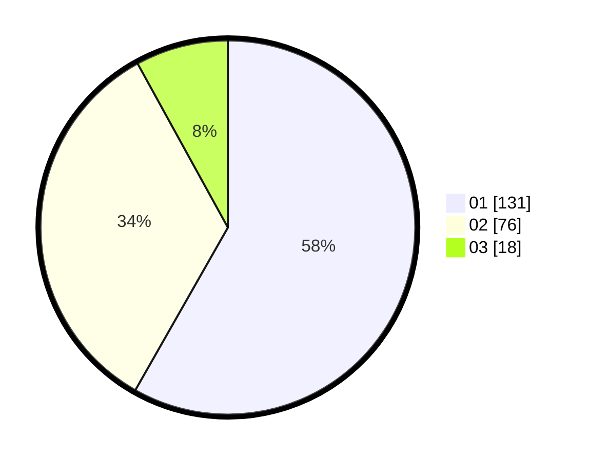

# Hasil

Hasil perolehan suara paslon dapat dilihat pada file paslon-01.txt, paslon-02.txt, dan paslon-03.txt.

Jika tidak ada, artinya data tersebut belum ada pada SIREKAP.

## Perolehan Suara

 * Paslon 01: **131**.
 * Paslon 02: **76**.
 * Paslon 03: **18**.

## Foto C Plano

https://sirekap-obj-formc.kpu.go.id/098f/pemilu/ppwp/31/73/05/10/02/3173051002078-20240215-094916--a653dc68-7260-4b8f-9777-e4798ce173c9.jpg

https://sirekap-obj-formc.kpu.go.id/098f/pemilu/ppwp/31/73/05/10/02/3173051002078-20240215-095050--dc05607e-8ac5-4bea-9720-64e8c8f8ad15.jpg
