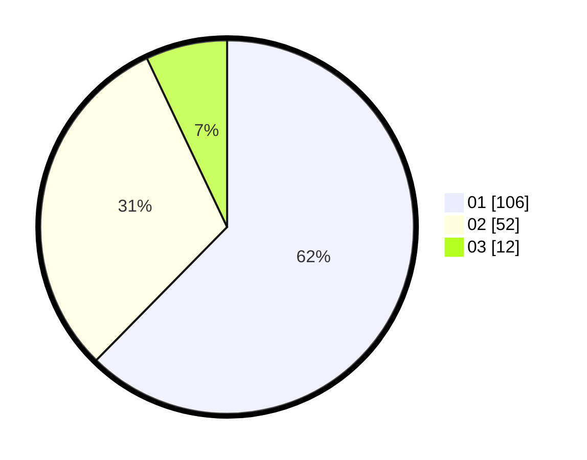

# Hasil

Hasil perolehan suara paslon dapat dilihat pada file paslon-01.txt, paslon-02.txt, dan paslon-03.txt.

Jika tidak ada, artinya data tersebut belum ada pada SIREKAP.

## Perolehan Suara

 * Paslon 01: **106**.
 * Paslon 02: **52**.
 * Paslon 03: **12**.

## Foto C Plano

https://sirekap-obj-formc.kpu.go.id/78b5/pemilu/ppwp/31/73/05/10/02/3173051002092-20240214-221223--5b70f52c-96eb-4e32-8b66-015fd756e9c6.jpg

https://sirekap-obj-formc.kpu.go.id/78b5/pemilu/ppwp/31/73/05/10/02/3173051002092-20240214-220045--34c866ab-1c69-4a88-b7d4-3860574d86ce.jpg

https://sirekap-obj-formc.kpu.go.id/78b5/pemilu/ppwp/31/73/05/10/02/3173051002092-20240214-220331--e4813f55-406c-4e1e-8876-358a68271fd0.jpg

## DATA PEMILIH TETAP

Jumlah pemilih dalam DPT: **217**.
 * L: **103**.
 * P: **114**.

## DATA PENGGUNA HAK PILIH

Jumlah pengguna hak pilih dalam DPT: **168**.
 * L: **74**.
 * P: **94**.

Jumlah pengguna hak pilih dalam DPTb: **2**.
 * L: **2**.
 * P: **0**.

Jumlah pengguna hak pilih dalam DPK: **1**.
 * L: **1**.
 * P: **0**.

Jumlah pengguna hak pilih: **171**.
 * L: **0**.
 * P: **0**.

## JUMLAH SUARA SAH DAN TIDAK SAH

JUMLAH SELURUH SUARA SAH: **170**.

JUMLAH SUARA TIDAK SAH: **1**.

JUMLAH SELURUH SUARA SAH DAN SUARA TIDAK SAH: **171**.
