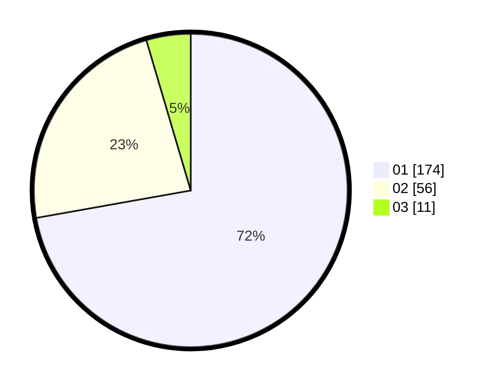

# Hasil

Hasil perolehan suara paslon dapat dilihat pada file paslon-01.txt, paslon-02.txt, dan paslon-03.txt.

Jika tidak ada, artinya data tersebut belum ada pada SIREKAP.

## Perolehan Suara

 * Paslon 01: **174**.
 * Paslon 02: **56**.
 * Paslon 03: **11**.

## Foto C Plano

https://sirekap-obj-formc.kpu.go.id/238f/pemilu/ppwp/31/73/05/10/02/3173051002097-20240214-223143--8d01982b-22e8-48e9-88ce-b2ef4557def1.jpg

https://sirekap-obj-formc.kpu.go.id/238f/pemilu/ppwp/31/73/05/10/02/3173051002097-20240214-223328--7c6ea0bc-bf46-48f7-bbb0-0b8a79c76d0b.jpg

https://sirekap-obj-formc.kpu.go.id/238f/pemilu/ppwp/31/73/05/10/02/3173051002097-20240214-223520--a8eb9979-706a-4288-80b0-aaf7616a16bd.jpg

## DATA PEMILIH TETAP

Jumlah pemilih dalam DPT: **249**.
 * L: **117**.
 * P: **132**.

## DATA PENGGUNA HAK PILIH

Jumlah pengguna hak pilih dalam DPT: **212**.
 * L: **99**.
 * P: **113**.

Jumlah pengguna hak pilih dalam DPTb: **8**.
 * L: **5**.
 * P: **3**.

Jumlah pengguna hak pilih dalam DPK: **22**.
 * L: **9**.
 * P: **13**.

Jumlah pengguna hak pilih: **242**.
 * L: **115**.
 * P: **127**.

## JUMLAH SUARA SAH DAN TIDAK SAH

JUMLAH SELURUH SUARA SAH: **241**.

JUMLAH SUARA TIDAK SAH: **1**.

JUMLAH SELURUH SUARA SAH DAN SUARA TIDAK SAH: **242**.
