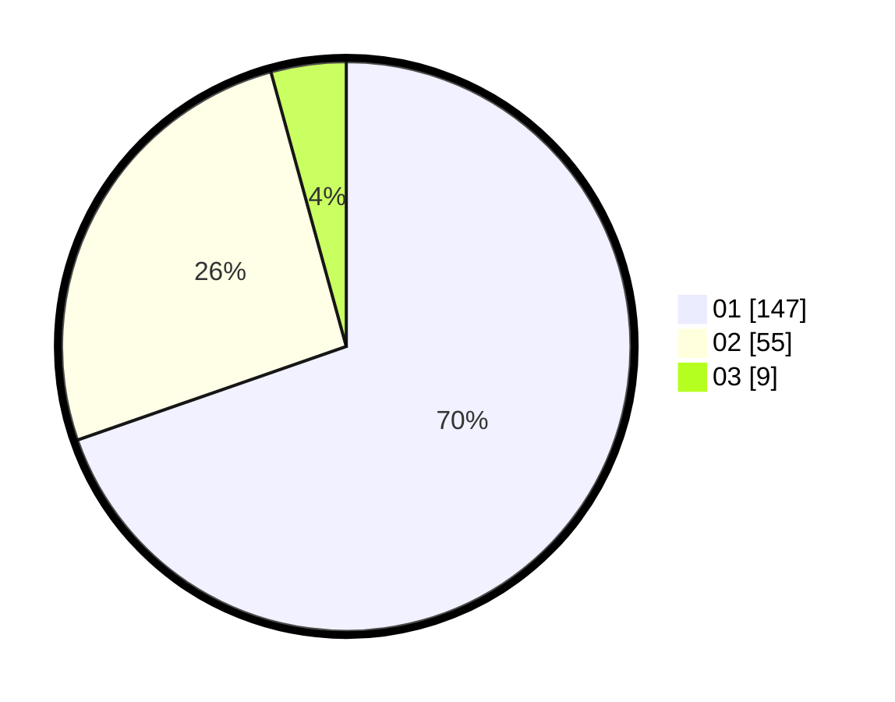

# Hasil

Hasil perolehan suara paslon dapat dilihat pada file paslon-01.txt, paslon-02.txt, dan paslon-03.txt.

Jika tidak ada, artinya data tersebut belum ada pada SIREKAP.

## Perolehan Suara

 * Paslon 01: **147**.
 * Paslon 02: **55**.
 * Paslon 03: **9**.

## Foto C Plano

https://sirekap-obj-formc.kpu.go.id/3eda/pemilu/ppwp/31/73/05/10/02/3173051002098-20240214-223600--a4caf034-49b5-484f-b2cd-a4d64fb67793.jpg

https://sirekap-obj-formc.kpu.go.id/3eda/pemilu/ppwp/31/73/05/10/02/3173051002098-20240214-223608--829bab0f-e551-4b57-9f74-11148b40596e.jpg

https://sirekap-obj-formc.kpu.go.id/3eda/pemilu/ppwp/31/73/05/10/02/3173051002098-20240214-223612--9d9a805c-7d4c-403f-8b94-4bc4a9e8a1a2.jpg
