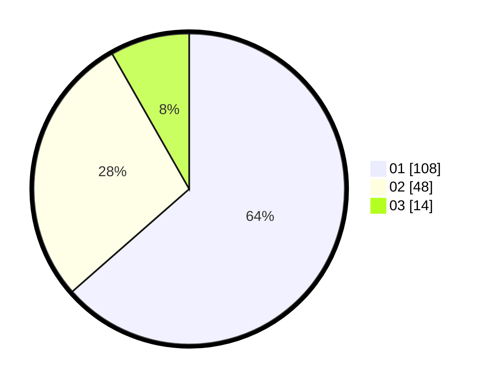

# Hasil

Hasil perolehan suara paslon dapat dilihat pada file paslon-01.txt, paslon-02.txt, dan paslon-03.txt.

Jika tidak ada, artinya data tersebut belum ada pada SIREKAP.

## Perolehan Suara

 * Paslon 01: **108**.
 * Paslon 02: **48**.
 * Paslon 03: **14**.

## Foto C Plano

https://sirekap-obj-formc.kpu.go.id/d925/pemilu/ppwp/31/73/05/10/02/3173051002103-20240214-221224--4f1c00ee-e058-4545-b807-f7c09ce0ab9b.jpg

https://sirekap-obj-formc.kpu.go.id/d925/pemilu/ppwp/31/73/05/10/02/3173051002103-20240214-222021--0afbffc9-df58-4e35-a6aa-9c9d2166669a.jpg

https://sirekap-obj-formc.kpu.go.id/d925/pemilu/ppwp/31/73/05/10/02/3173051002103-20240214-222234--8dbe8fde-d406-4ebc-8c31-4c7efee4b587.jpg
