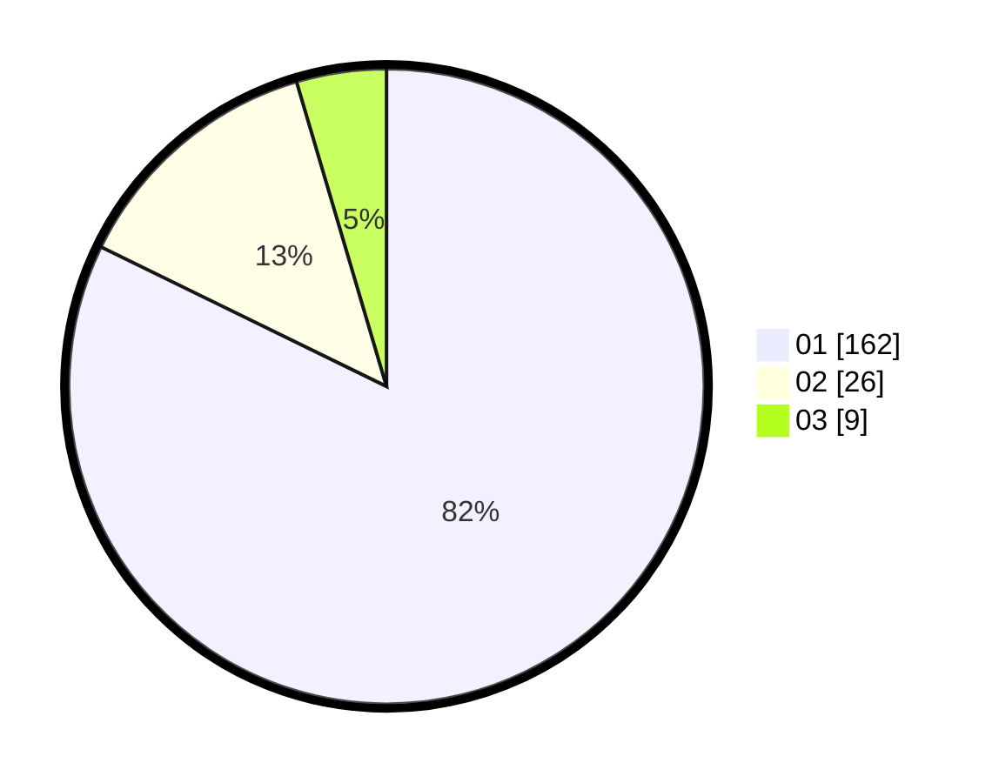

# Hasil

Hasil perolehan suara paslon dapat dilihat pada file paslon-01.txt, paslon-02.txt, dan paslon-03.txt.

Jika tidak ada, artinya data tersebut belum ada pada SIREKAP.

## Perolehan Suara

 * Paslon 01: **162**.
 * Paslon 02: **26**.
 * Paslon 03: **9**.

## Foto C Plano

https://sirekap-obj-formc.kpu.go.id/4cd3/pemilu/ppwp/31/73/05/10/02/3173051002104-20240215-005332--3fa98cfa-dc22-4573-8a74-2c7e9b34504f.jpg

https://sirekap-obj-formc.kpu.go.id/4cd3/pemilu/ppwp/31/73/05/10/02/3173051002104-20240215-005444--c8886414-0b27-4bf5-82ba-aec8944426a8.jpg

https://sirekap-obj-formc.kpu.go.id/4cd3/pemilu/ppwp/31/73/05/10/02/3173051002104-20240215-005530--1b64479b-dee8-4b13-81a1-501ca0af22e1.jpg

## DATA PEMILIH TETAP

Jumlah pemilih dalam DPT: **226**.
 * L: **100**.
 * P: **126**.

## DATA PENGGUNA HAK PILIH

Jumlah pengguna hak pilih dalam DPT: **200**.
 * L: **89**.
 * P: **111**.

Jumlah pengguna hak pilih dalam DPTb: **1**.
 * L: **0**.
 * P: **1**.

Jumlah pengguna hak pilih dalam DPK: **1**.
 * L: **1**.
 * P: **0**.

Jumlah pengguna hak pilih: **202**.
 * L: **90**.
 * P: **112**.

## JUMLAH SUARA SAH DAN TIDAK SAH

JUMLAH SELURUH SUARA SAH: **197**.

JUMLAH SUARA TIDAK SAH: **5**.

JUMLAH SELURUH SUARA SAH DAN SUARA TIDAK SAH: **202**.
