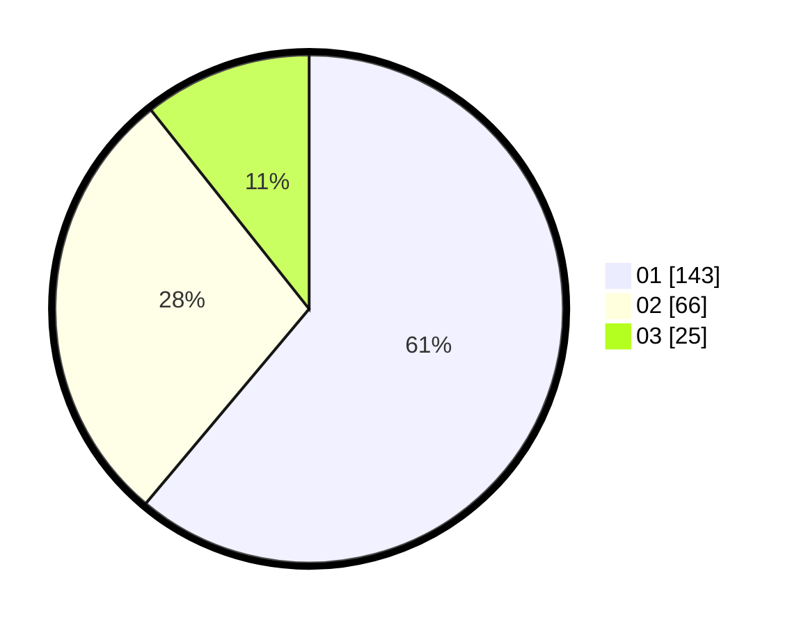

# Hasil

Hasil perolehan suara paslon dapat dilihat pada file paslon-01.txt, paslon-02.txt, dan paslon-03.txt.

Jika tidak ada, artinya data tersebut belum ada pada SIREKAP.

## Perolehan Suara

 * Paslon 01: **143**.
 * Paslon 02: **66**.
 * Paslon 03: **25**.

## Foto C Plano

https://sirekap-obj-formc.kpu.go.id/a724/pemilu/ppwp/31/73/05/10/02/3173051002105-20240215-002317--fdaa73b3-41c4-411a-8e00-010da4a6c88d.jpg

https://sirekap-obj-formc.kpu.go.id/a724/pemilu/ppwp/31/73/05/10/02/3173051002105-20240215-002352--25998f64-b43e-475a-bed1-e2ffdb14a483.jpg

https://sirekap-obj-formc.kpu.go.id/a724/pemilu/ppwp/31/73/05/10/02/3173051002105-20240215-002416--39456782-0140-4e0a-8408-07b4db9de488.jpg
