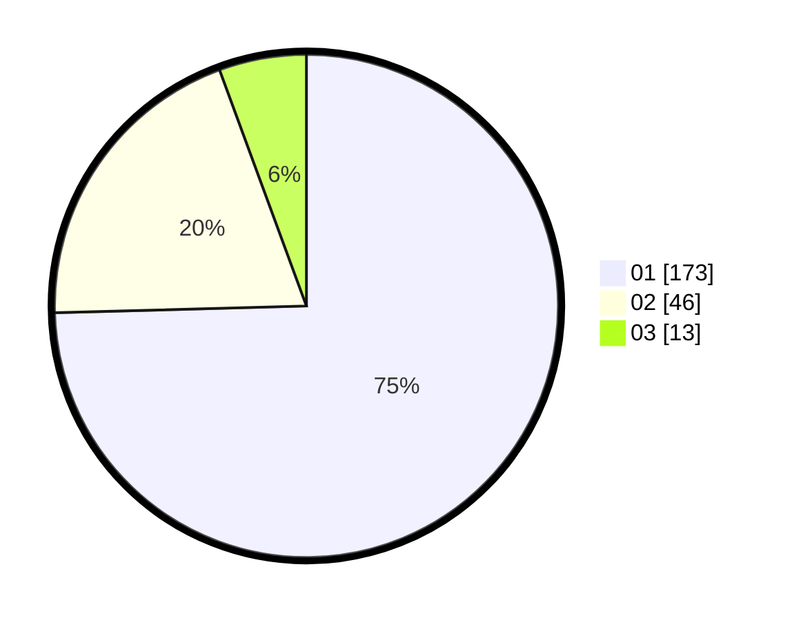

# Hasil

Hasil perolehan suara paslon dapat dilihat pada file paslon-01.txt, paslon-02.txt, dan paslon-03.txt.

Jika tidak ada, artinya data tersebut belum ada pada SIREKAP.

## Perolehan Suara

 * Paslon 01: **173**.
 * Paslon 02: **46**.
 * Paslon 03: **13**.

## Foto C Plano

https://sirekap-obj-formc.kpu.go.id/6658/pemilu/ppwp/31/73/05/10/02/3173051002120-20240215-014219--56445a36-92b7-4730-af94-a8c88d1b48cf.jpg

https://sirekap-obj-formc.kpu.go.id/6658/pemilu/ppwp/31/73/05/10/02/3173051002120-20240215-014329--75116d03-322c-49a7-86e2-20c51bb6a53f.jpg

https://sirekap-obj-formc.kpu.go.id/6658/pemilu/ppwp/31/73/05/10/02/3173051002120-20240215-014414--51320fa4-c836-4c04-ac57-9b1d8866c7bd.jpg
