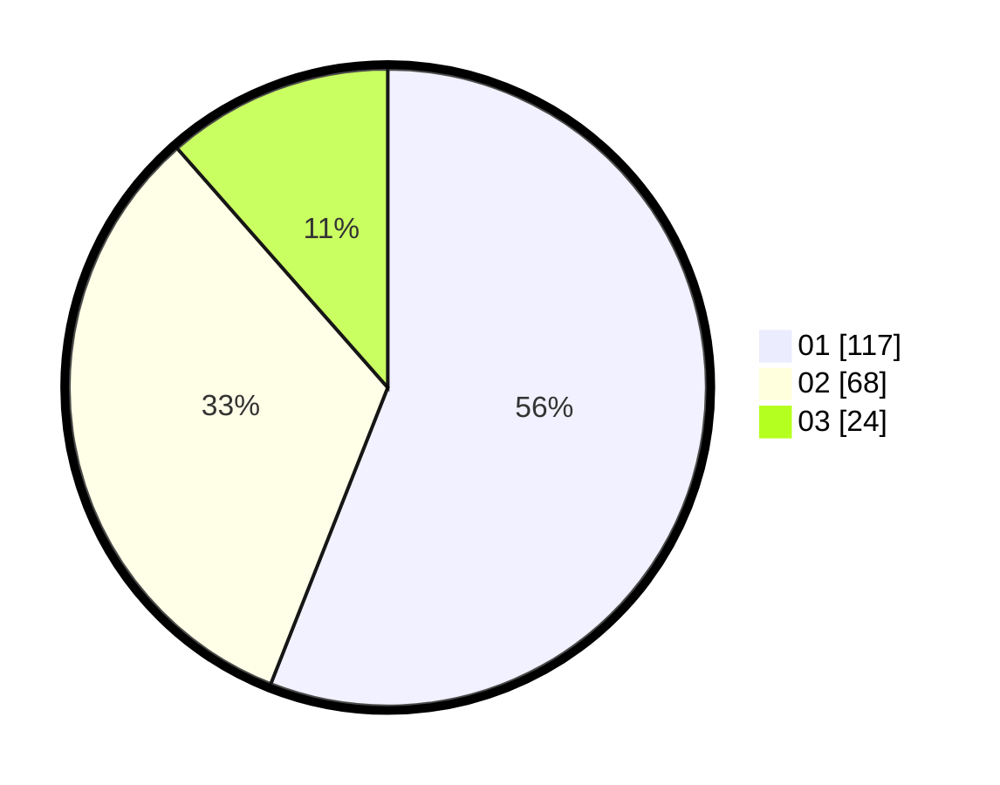

# Hasil

Hasil perolehan suara paslon dapat dilihat pada file paslon-01.txt, paslon-02.txt, dan paslon-03.txt.

Jika tidak ada, artinya data tersebut belum ada pada SIREKAP.

## Perolehan Suara

 * Paslon 01: **117**.
 * Paslon 02: **68**.
 * Paslon 03: **24**.

## Foto C Plano

https://sirekap-obj-formc.kpu.go.id/bc29/pemilu/ppwp/31/73/05/10/03/3173051003003-20240214-205734--00629bc8-3a1d-48fe-939c-4cbebf1d4568.jpg

https://sirekap-obj-formc.kpu.go.id/bc29/pemilu/ppwp/31/73/05/10/03/3173051003003-20240214-201503--5d037e0a-00bc-46fc-aef8-e1e62798f7c1.jpg

https://sirekap-obj-formc.kpu.go.id/bc29/pemilu/ppwp/31/73/05/10/03/3173051003003-20240214-201616--cbc7e6d3-4c27-47ae-92a2-ddc7b67cbf21.jpg

## DATA PEMILIH TETAP

Jumlah pemilih dalam DPT: **287**.
 * L: **137**.
 * P: **150**.

## DATA PENGGUNA HAK PILIH

Jumlah pengguna hak pilih dalam DPT: **210**.
 * L: **101**.
 * P: **109**.

Jumlah pengguna hak pilih dalam DPTb: **1**.
 * L: **0**.
 * P: **1**.

Jumlah pengguna hak pilih dalam DPK: **2**.
 * L: **1**.
 * P: **1**.

Jumlah pengguna hak pilih: **213**.
 * L: **102**.
 * P: **111**.

## JUMLAH SUARA SAH DAN TIDAK SAH

JUMLAH SELURUH SUARA SAH: **209**.

JUMLAH SUARA TIDAK SAH: **4**.

JUMLAH SELURUH SUARA SAH DAN SUARA TIDAK SAH: **213**.
