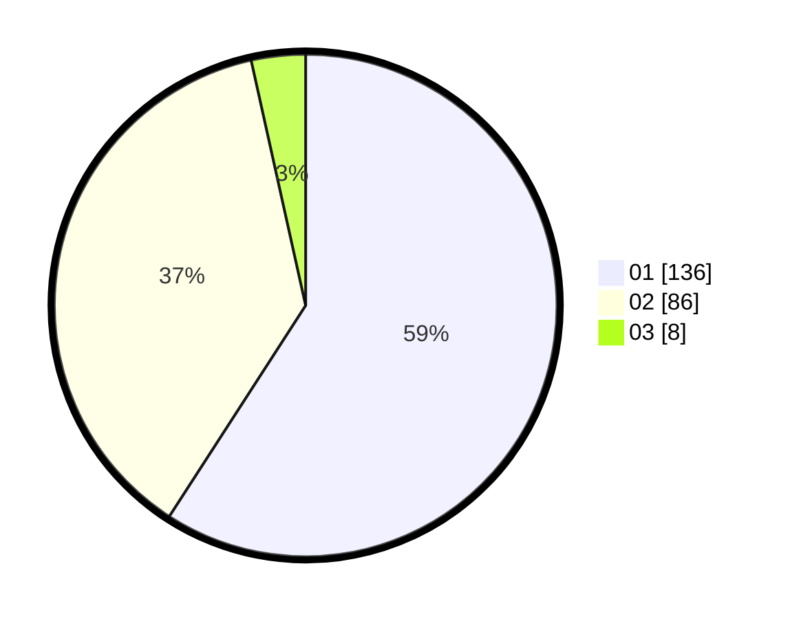

# Hasil

Hasil perolehan suara paslon dapat dilihat pada file paslon-01.txt, paslon-02.txt, dan paslon-03.txt.

Jika tidak ada, artinya data tersebut belum ada pada SIREKAP.

## Perolehan Suara

 * Paslon 01: **136**.
 * Paslon 02: **86**.
 * Paslon 03: **8**.

## Foto C Plano

https://sirekap-obj-formc.kpu.go.id/b7d0/pemilu/ppwp/31/73/05/10/03/3173051003005-20240215-035858--50387efb-43c3-4be9-b3ef-72ac7bde44c1.jpg

https://sirekap-obj-formc.kpu.go.id/b7d0/pemilu/ppwp/31/73/05/10/03/3173051003005-20240215-035924--83389659-1405-4ee6-bea9-c67e34ff28d0.jpg

https://sirekap-obj-formc.kpu.go.id/b7d0/pemilu/ppwp/31/73/05/10/03/3173051003005-20240215-035908--b1a1b991-bf65-4f4b-8513-c11aaa6ea135.jpg

## DATA PEMILIH TETAP

Jumlah pemilih dalam DPT: **276**.
 * L: **145**.
 * P: **131**.

## DATA PENGGUNA HAK PILIH

Jumlah pengguna hak pilih dalam DPT: **229**.
 * L: **115**.
 * P: **114**.

Jumlah pengguna hak pilih dalam DPTb: **2**.
 * L: **1**.
 * P: **1**.

Jumlah pengguna hak pilih dalam DPK: **1**.
 * L: **0**.
 * P: **1**.

Jumlah pengguna hak pilih: **232**.
 * L: **116**.
 * P: **116**.

## JUMLAH SUARA SAH DAN TIDAK SAH

JUMLAH SELURUH SUARA SAH: **230**.

JUMLAH SUARA TIDAK SAH: **2**.

JUMLAH SELURUH SUARA SAH DAN SUARA TIDAK SAH: **232**.
