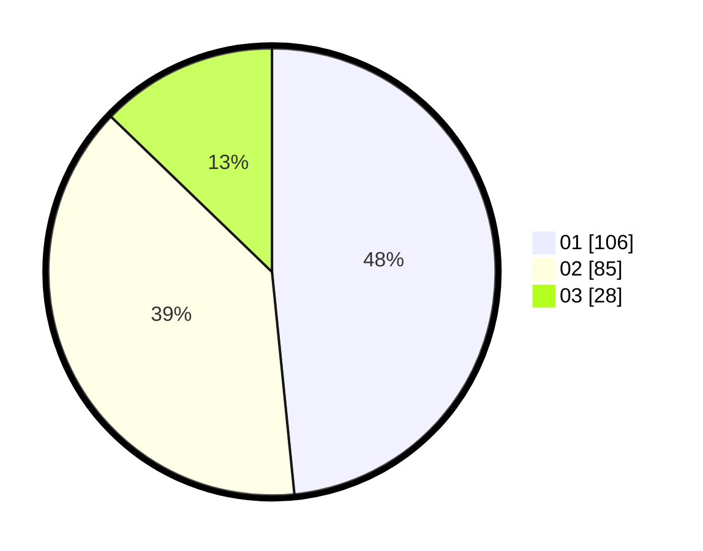

# Hasil

Hasil perolehan suara paslon dapat dilihat pada file paslon-01.txt, paslon-02.txt, dan paslon-03.txt.

Jika tidak ada, artinya data tersebut belum ada pada SIREKAP.

## Perolehan Suara

 * Paslon 01: **106**.
 * Paslon 02: **85**.
 * Paslon 03: **28**.

## Foto C Plano

https://sirekap-obj-formc.kpu.go.id/18d0/pemilu/ppwp/31/73/05/10/03/3173051003006-20240216-150706--e4ef4724-3a89-42e8-9002-871333d00cf8.jpg

https://sirekap-obj-formc.kpu.go.id/18d0/pemilu/ppwp/31/73/05/10/03/3173051003006-20240216-151959--52ddf6fd-b4ad-46d4-a922-7f1f07e7b4b0.jpg

https://sirekap-obj-formc.kpu.go.id/18d0/pemilu/ppwp/31/73/05/10/03/3173051003006-20240216-151254--2c427f31-f757-4d2f-ba63-3cf97cab913b.jpg
