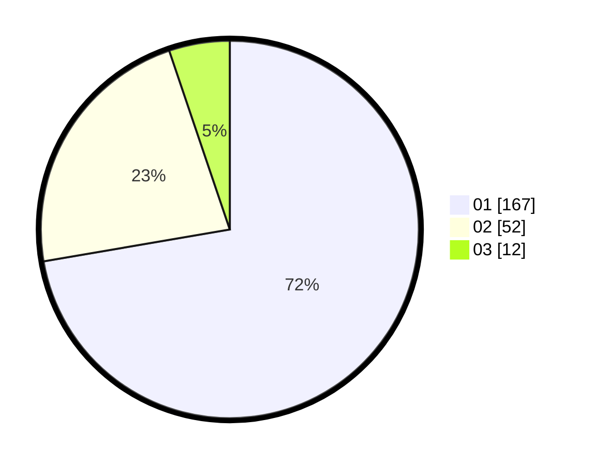

# Hasil

Hasil perolehan suara paslon dapat dilihat pada file paslon-01.txt, paslon-02.txt, dan paslon-03.txt.

Jika tidak ada, artinya data tersebut belum ada pada SIREKAP.

## Perolehan Suara

 * Paslon 01: **167**.
 * Paslon 02: **52**.
 * Paslon 03: **12**.

## Foto C Plano

https://sirekap-obj-formc.kpu.go.id/a562/pemilu/ppwp/31/73/05/10/03/3173051003012-20240214-204200--af7cf8a5-b5ae-4635-a551-314545be358f.jpg

https://sirekap-obj-formc.kpu.go.id/a562/pemilu/ppwp/31/73/05/10/03/3173051003012-20240214-204232--bc12af13-ebe3-475f-8f94-473fb18dec44.jpg

https://sirekap-obj-formc.kpu.go.id/a562/pemilu/ppwp/31/73/05/10/03/3173051003012-20240214-204136--5046a90d-91d4-4506-a547-2b9e33c02f9b.jpg

## DATA PEMILIH TETAP

Jumlah pemilih dalam DPT: **288**.
 * L: **138**.
 * P: **150**.

## DATA PENGGUNA HAK PILIH

Jumlah pengguna hak pilih dalam DPT: **231**.
 * L: **105**.
 * P: **126**.

Jumlah pengguna hak pilih dalam DPTb: **2**.
 * L: **0**.
 * P: **2**.

Jumlah pengguna hak pilih dalam DPK: **2**.
 * L: **0**.
 * P: **2**.

Jumlah pengguna hak pilih: **235**.
 * L: **105**.
 * P: **130**.

## JUMLAH SUARA SAH DAN TIDAK SAH

JUMLAH SELURUH SUARA SAH: **231**.

JUMLAH SUARA TIDAK SAH: **4**.

JUMLAH SELURUH SUARA SAH DAN SUARA TIDAK SAH: **235**.
