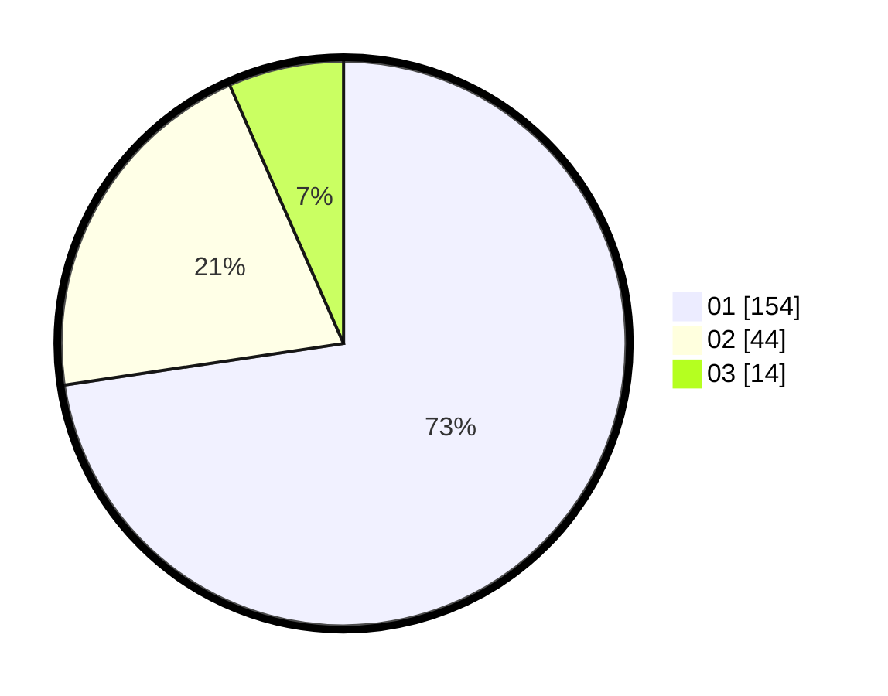

# Hasil

Hasil perolehan suara paslon dapat dilihat pada file paslon-01.txt, paslon-02.txt, dan paslon-03.txt.

Jika tidak ada, artinya data tersebut belum ada pada SIREKAP.

## Perolehan Suara

 * Paslon 01: **154**.
 * Paslon 02: **44**.
 * Paslon 03: **14**.

## Foto C Plano

https://sirekap-obj-formc.kpu.go.id/3b90/pemilu/ppwp/31/73/05/10/03/3173051003014-20240214-203900--552d7512-991c-4ce7-8fc9-9997f41c84d1.jpg

https://sirekap-obj-formc.kpu.go.id/3b90/pemilu/ppwp/31/73/05/10/03/3173051003014-20240214-204336--d87609d1-53bf-4d7c-b2e7-8d72c1898baf.jpg
