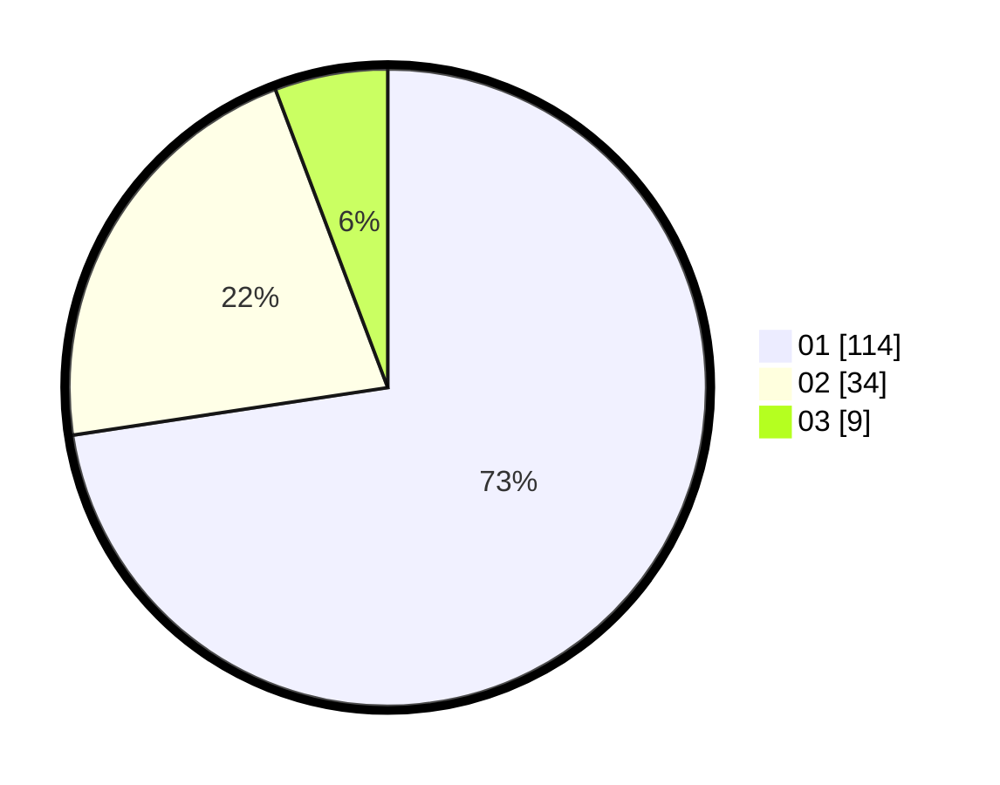

# Hasil

Hasil perolehan suara paslon dapat dilihat pada file paslon-01.txt, paslon-02.txt, dan paslon-03.txt.

Jika tidak ada, artinya data tersebut belum ada pada SIREKAP.

## Perolehan Suara

 * Paslon 01: **114**.
 * Paslon 02: **34**.
 * Paslon 03: **9**.

## Foto C Plano

https://sirekap-obj-formc.kpu.go.id/12e1/pemilu/ppwp/31/73/05/10/03/3173051003016-20240214-231829--03cc0c75-36cb-4978-bdc9-7e61b0771095.jpg

https://sirekap-obj-formc.kpu.go.id/12e1/pemilu/ppwp/31/73/05/10/03/3173051003016-20240214-231900--cc3c3044-1aba-41d4-94df-120465f98b90.jpg

https://sirekap-obj-formc.kpu.go.id/12e1/pemilu/ppwp/31/73/05/10/03/3173051003016-20240214-231933--3e902e93-e8c9-4842-abef-1df3f12d0217.jpg
