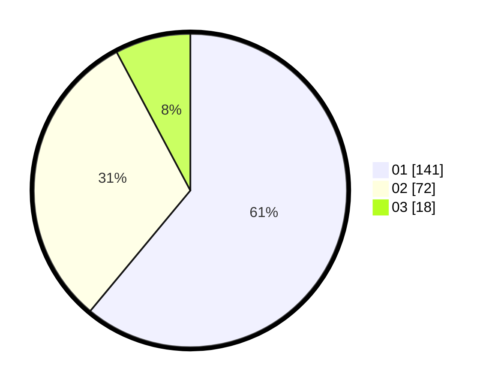

# Hasil

Hasil perolehan suara paslon dapat dilihat pada file paslon-01.txt, paslon-02.txt, dan paslon-03.txt.

Jika tidak ada, artinya data tersebut belum ada pada SIREKAP.

## Perolehan Suara

 * Paslon 01: **141**.
 * Paslon 02: **72**.
 * Paslon 03: **18**.

## Foto C Plano

https://sirekap-obj-formc.kpu.go.id/65f7/pemilu/ppwp/31/73/05/10/03/3173051003017-20240214-232721--a76a5b51-ffab-480e-8a8e-ebf09823a1f5.jpg

https://sirekap-obj-formc.kpu.go.id/65f7/pemilu/ppwp/31/73/05/10/03/3173051003017-20240214-220538--c822660f-9976-48a2-bd08-ebb6224a76c1.jpg

https://sirekap-obj-formc.kpu.go.id/65f7/pemilu/ppwp/31/73/05/10/03/3173051003017-20240214-220806--4e9f7b36-6b48-4795-b649-08560a433ea9.jpg
