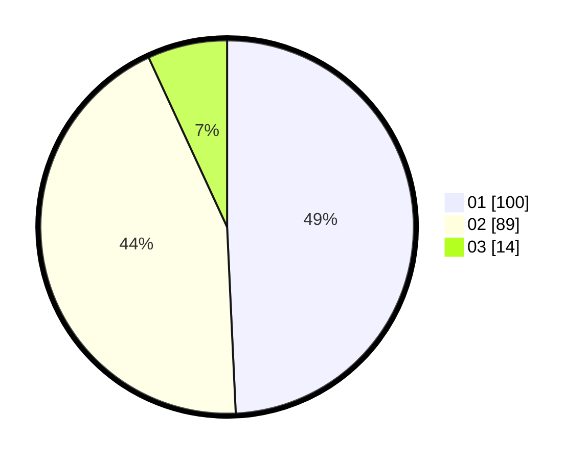

# Hasil

Hasil perolehan suara paslon dapat dilihat pada file paslon-01.txt, paslon-02.txt, dan paslon-03.txt.

Jika tidak ada, artinya data tersebut belum ada pada SIREKAP.

## Perolehan Suara

 * Paslon 01: **100**.
 * Paslon 02: **89**.
 * Paslon 03: **14**.

## Foto C Plano

https://sirekap-obj-formc.kpu.go.id/16bb/pemilu/ppwp/31/73/05/10/03/3173051003019-20240214-234621--a35439e5-cf7a-43d9-81c8-36b841b87844.jpg

https://sirekap-obj-formc.kpu.go.id/16bb/pemilu/ppwp/31/73/05/10/03/3173051003019-20240214-232712--aa14ce77-bab8-4539-9650-5589633761a5.jpg

https://sirekap-obj-formc.kpu.go.id/16bb/pemilu/ppwp/31/73/05/10/03/3173051003019-20240214-232828--97fae380-675c-4620-8a7a-729b9c21fc45.jpg
