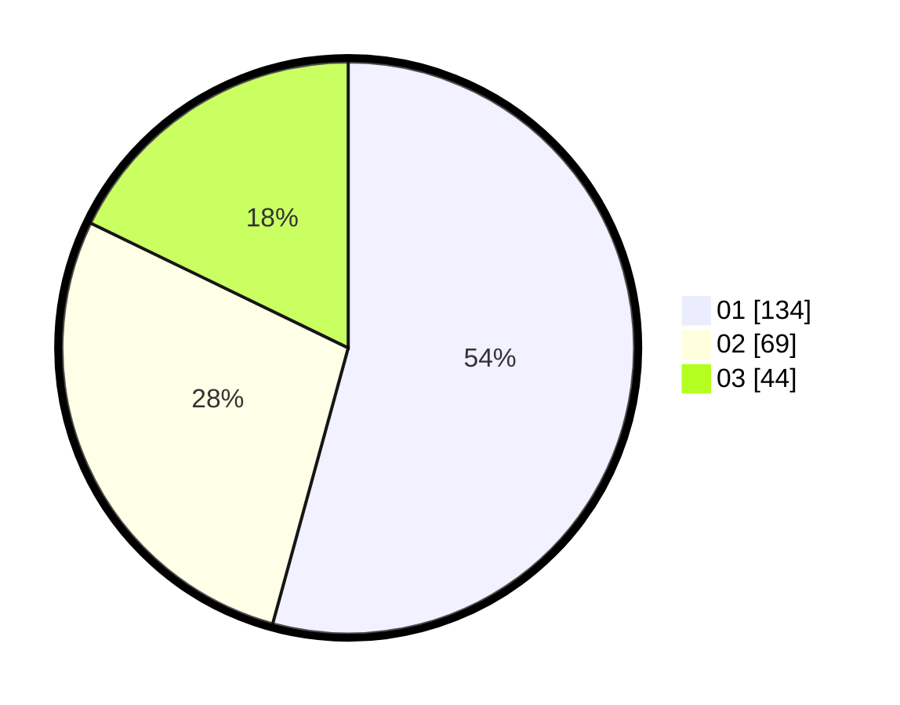

# Hasil

Hasil perolehan suara paslon dapat dilihat pada file paslon-01.txt, paslon-02.txt, dan paslon-03.txt.

Jika tidak ada, artinya data tersebut belum ada pada SIREKAP.

## Perolehan Suara

 * Paslon 01: **134**.
 * Paslon 02: **69**.
 * Paslon 03: **44**.

## Foto C Plano

https://sirekap-obj-formc.kpu.go.id/fb9e/pemilu/ppwp/31/73/05/10/03/3173051003021-20240214-185942--0017fdbc-228b-49de-b45c-4d60de13f687.jpg

https://sirekap-obj-formc.kpu.go.id/fb9e/pemilu/ppwp/31/73/05/10/03/3173051003021-20240214-155916--98abd3b0-2631-4e16-9519-a282f204c77a.jpg

https://sirekap-obj-formc.kpu.go.id/fb9e/pemilu/ppwp/31/73/05/10/03/3173051003021-20240214-191144--5625746c-eb43-4c5e-81f7-1b44bbbd6403.jpg

## DATA PEMILIH TETAP

Jumlah pemilih dalam DPT: **274**.
 * L: **123**.
 * P: **151**.

## DATA PENGGUNA HAK PILIH

Jumlah pengguna hak pilih dalam DPT: **224**.
 * L: **99**.
 * P: **125**.

Jumlah pengguna hak pilih dalam DPTb: **0**.
 * L: **0**.
 * P: **0**.

Jumlah pengguna hak pilih dalam DPK: **0**.
 * L: **0**.
 * P: **0**.

Jumlah pengguna hak pilih: **224**.
 * L: **99**.
 * P: **125**.

## JUMLAH SUARA SAH DAN TIDAK SAH

JUMLAH SELURUH SUARA SAH: **222**.

JUMLAH SUARA TIDAK SAH: **2**.

JUMLAH SELURUH SUARA SAH DAN SUARA TIDAK SAH: **224**.
