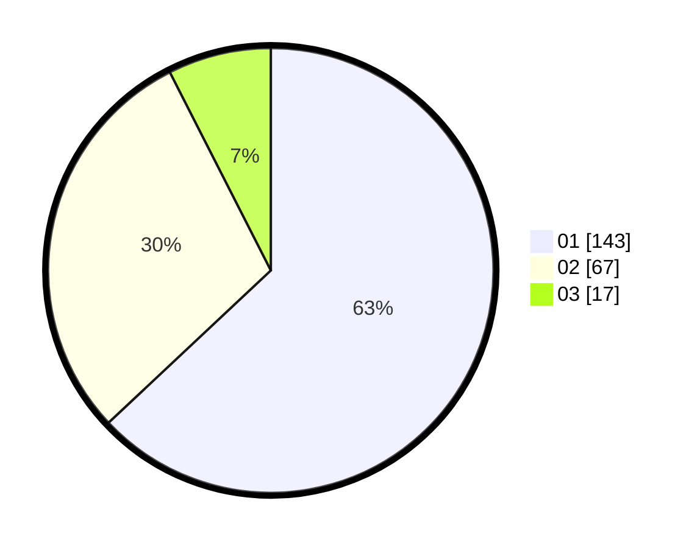

# Hasil

Hasil perolehan suara paslon dapat dilihat pada file paslon-01.txt, paslon-02.txt, dan paslon-03.txt.

Jika tidak ada, artinya data tersebut belum ada pada SIREKAP.

## Perolehan Suara

 * Paslon 01: **143**.
 * Paslon 02: **67**.
 * Paslon 03: **17**.

## Foto C Plano

https://sirekap-obj-formc.kpu.go.id/1111/pemilu/ppwp/31/73/05/10/03/3173051003022-20240214-195141--f56d7ca6-c303-4a07-b3a0-ed2e50446c48.jpg

https://sirekap-obj-formc.kpu.go.id/1111/pemilu/ppwp/31/73/05/10/03/3173051003022-20240214-195201--7ba200b8-3c2b-46fa-9884-41f9ab575bdc.jpg

https://sirekap-obj-formc.kpu.go.id/1111/pemilu/ppwp/31/73/05/10/03/3173051003022-20240214-195239--eb2fa9f8-1557-4793-86b4-a2e448542369.jpg

## DATA PEMILIH TETAP

Jumlah pemilih dalam DPT: **272**.
 * L: **136**.
 * P: **136**.

## DATA PENGGUNA HAK PILIH

Jumlah pengguna hak pilih dalam DPT: **215**.
 * L: **100**.
 * P: **115**.

Jumlah pengguna hak pilih dalam DPTb: **7**.
 * L: **5**.
 * P: **2**.

Jumlah pengguna hak pilih dalam DPK: **7**.
 * L: **3**.
 * P: **4**.

Jumlah pengguna hak pilih: **229**.
 * L: **108**.
 * P: **121**.

## JUMLAH SUARA SAH DAN TIDAK SAH

JUMLAH SELURUH SUARA SAH: **227**.

JUMLAH SUARA TIDAK SAH: **2**.

JUMLAH SELURUH SUARA SAH DAN SUARA TIDAK SAH: **229**.
