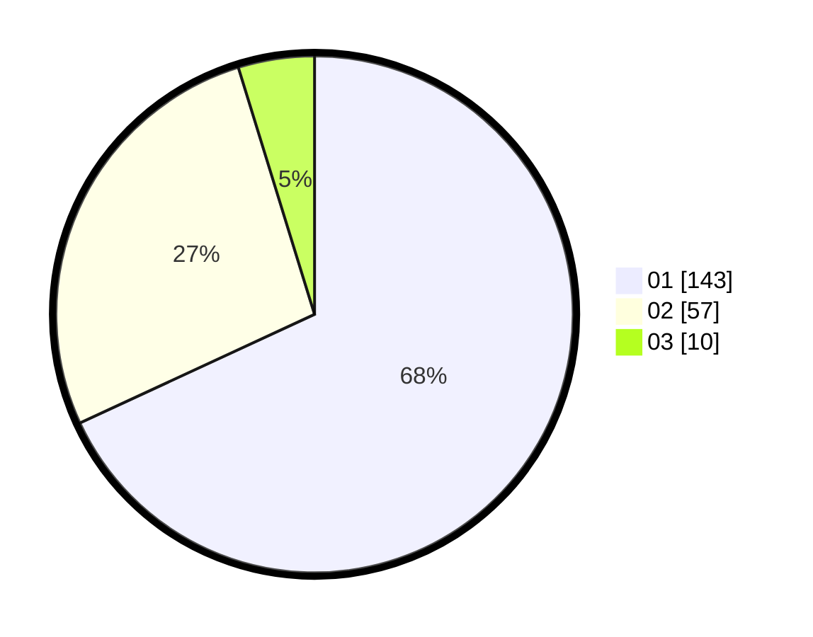

# Hasil

Hasil perolehan suara paslon dapat dilihat pada file paslon-01.txt, paslon-02.txt, dan paslon-03.txt.

Jika tidak ada, artinya data tersebut belum ada pada SIREKAP.

## Perolehan Suara

 * Paslon 01: **143**.
 * Paslon 02: **57**.
 * Paslon 03: **10**.

## Foto C Plano

https://sirekap-obj-formc.kpu.go.id/0e6c/pemilu/ppwp/31/73/05/10/03/3173051003023-20240215-003908--4fb970c0-6d96-4129-89b5-0d2fa76533b7.jpg

https://sirekap-obj-formc.kpu.go.id/0e6c/pemilu/ppwp/31/73/05/10/03/3173051003023-20240215-004039--8c12d0bf-e867-482b-afaf-7b59fc42b9fc.jpg

https://sirekap-obj-formc.kpu.go.id/0e6c/pemilu/ppwp/31/73/05/10/03/3173051003023-20240215-004143--26d65e10-2a07-4b06-bda4-f88c987eedd0.jpg
