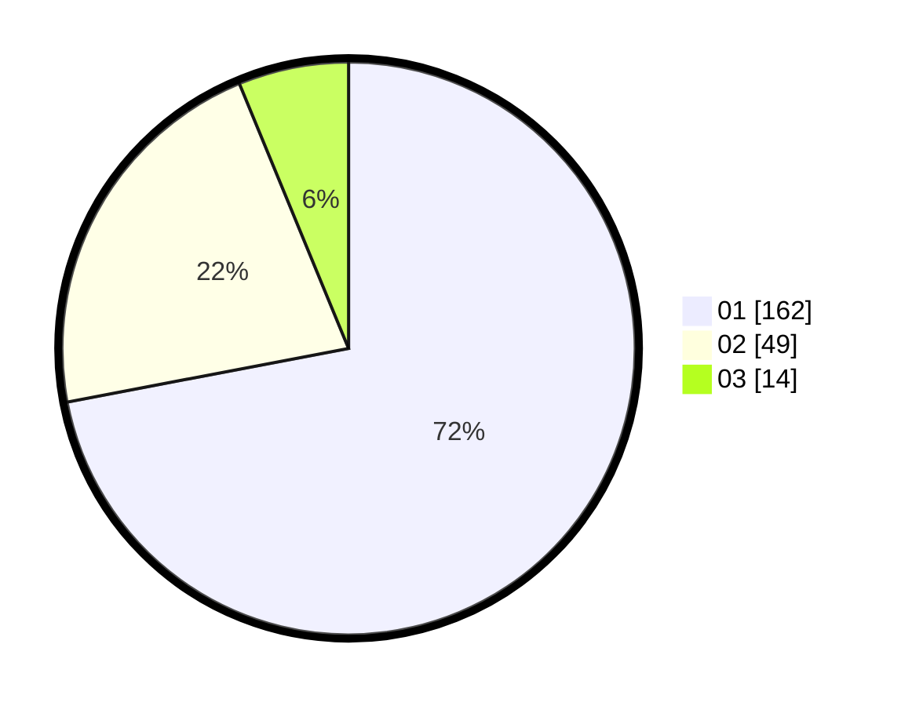

# Hasil

Hasil perolehan suara paslon dapat dilihat pada file paslon-01.txt, paslon-02.txt, dan paslon-03.txt.

Jika tidak ada, artinya data tersebut belum ada pada SIREKAP.

## Perolehan Suara

 * Paslon 01: **162**.
 * Paslon 02: **49**.
 * Paslon 03: **14**.

## Foto C Plano

https://sirekap-obj-formc.kpu.go.id/d460/pemilu/ppwp/31/73/05/10/03/3173051003024-20240214-200202--4a9fb7a4-4e0e-4b11-b432-ed1ec814a0d7.jpg

https://sirekap-obj-formc.kpu.go.id/d460/pemilu/ppwp/31/73/05/10/03/3173051003024-20240214-233653--1dcff91f-5415-4665-8261-cf25faf1e579.jpg

https://sirekap-obj-formc.kpu.go.id/d460/pemilu/ppwp/31/73/05/10/03/3173051003024-20240214-200407--55aaaf75-9942-4091-8084-ecbb7dc30092.jpg
