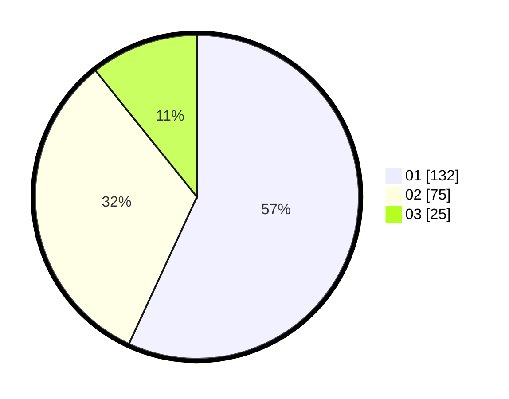

# Hasil

Hasil perolehan suara paslon dapat dilihat pada file paslon-01.txt, paslon-02.txt, dan paslon-03.txt.

Jika tidak ada, artinya data tersebut belum ada pada SIREKAP.

## Perolehan Suara

 * Paslon 01: **132**.
 * Paslon 02: **75**.
 * Paslon 03: **25**.

## Foto C Plano

https://sirekap-obj-formc.kpu.go.id/5b81/pemilu/ppwp/31/73/05/10/03/3173051003026-20240216-112636--7d39017c-506c-4235-90e4-7837e307ebc1.jpg

https://sirekap-obj-formc.kpu.go.id/5b81/pemilu/ppwp/31/73/05/10/03/3173051003026-20240214-184611--190fa17b-c066-4891-afdb-d8cbaa560c8a.jpg

https://sirekap-obj-formc.kpu.go.id/5b81/pemilu/ppwp/31/73/05/10/03/3173051003026-20240214-185631--d05d5dce-f0c2-4702-b1cc-44a584dd16eb.jpg

## DATA PEMILIH TETAP

Jumlah pemilih dalam DPT: **276**.
 * L: **136**.
 * P: **140**.

## DATA PENGGUNA HAK PILIH

Jumlah pengguna hak pilih dalam DPT: **229**.
 * L: **110**.
 * P: **119**.

Jumlah pengguna hak pilih dalam DPTb: **5**.
 * L: **1**.
 * P: **4**.

Jumlah pengguna hak pilih dalam DPK: **0**.
 * L: **0**.
 * P: **0**.

Jumlah pengguna hak pilih: **234**.
 * L: **111**.
 * P: **123**.

## JUMLAH SUARA SAH DAN TIDAK SAH

JUMLAH SELURUH SUARA SAH: **232**.

JUMLAH SUARA TIDAK SAH: **2**.

JUMLAH SELURUH SUARA SAH DAN SUARA TIDAK SAH: **234**.
