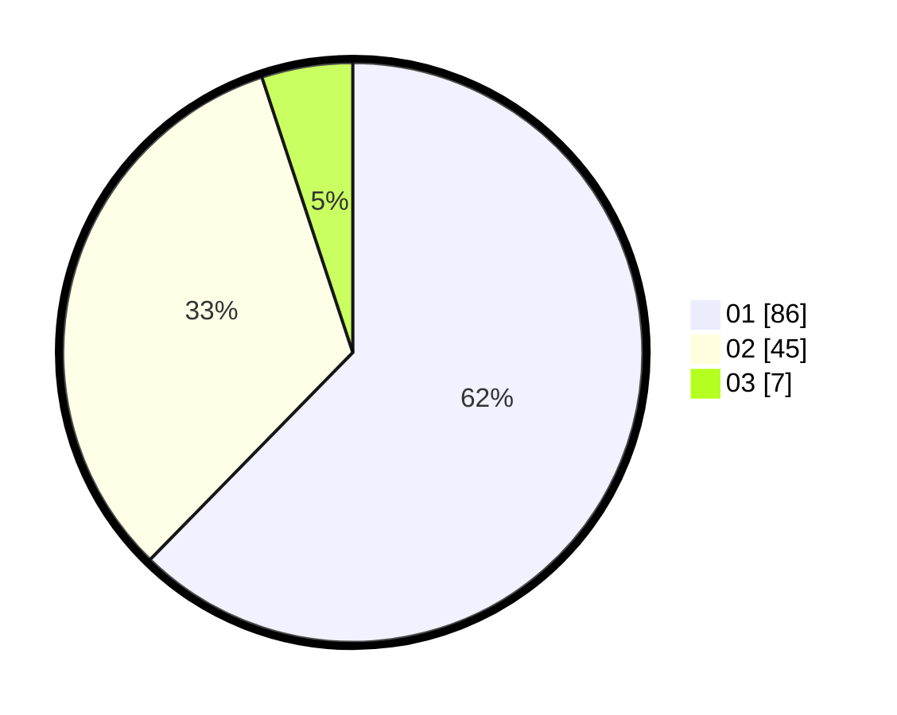

# Hasil

Hasil perolehan suara paslon dapat dilihat pada file paslon-01.txt, paslon-02.txt, dan paslon-03.txt.

Jika tidak ada, artinya data tersebut belum ada pada SIREKAP.

## Perolehan Suara

 * Paslon 01: **86**.
 * Paslon 02: **45**.
 * Paslon 03: **7**.

## Foto C Plano

https://sirekap-obj-formc.kpu.go.id/30e0/pemilu/ppwp/31/73/05/10/03/3173051003027-20240214-184535--e99e3008-4365-478a-9511-b3e570e91aef.jpg

https://sirekap-obj-formc.kpu.go.id/30e0/pemilu/ppwp/31/73/05/10/03/3173051003027-20240214-230343--05c485bb-7f84-48a6-be3f-bb0b73718dc2.jpg

https://sirekap-obj-formc.kpu.go.id/30e0/pemilu/ppwp/31/73/05/10/03/3173051003027-20240214-192253--d165918d-67a9-4fbf-b764-249162214dc2.jpg

## DATA PEMILIH TETAP

Jumlah pemilih dalam DPT: **160**.
 * L: **85**.
 * P: **75**.

## DATA PENGGUNA HAK PILIH

Jumlah pengguna hak pilih dalam DPT: **132**.
 * L: **70**.
 * P: **62**.

Jumlah pengguna hak pilih dalam DPTb: **6**.
 * L: **4**.
 * P: **2**.

Jumlah pengguna hak pilih dalam DPK: **2**.
 * L: **0**.
 * P: **2**.

Jumlah pengguna hak pilih: **140**.
 * L: **74**.
 * P: **66**.

## JUMLAH SUARA SAH DAN TIDAK SAH

JUMLAH SELURUH SUARA SAH: **138**.

JUMLAH SUARA TIDAK SAH: **2**.

JUMLAH SELURUH SUARA SAH DAN SUARA TIDAK SAH: **140**.
