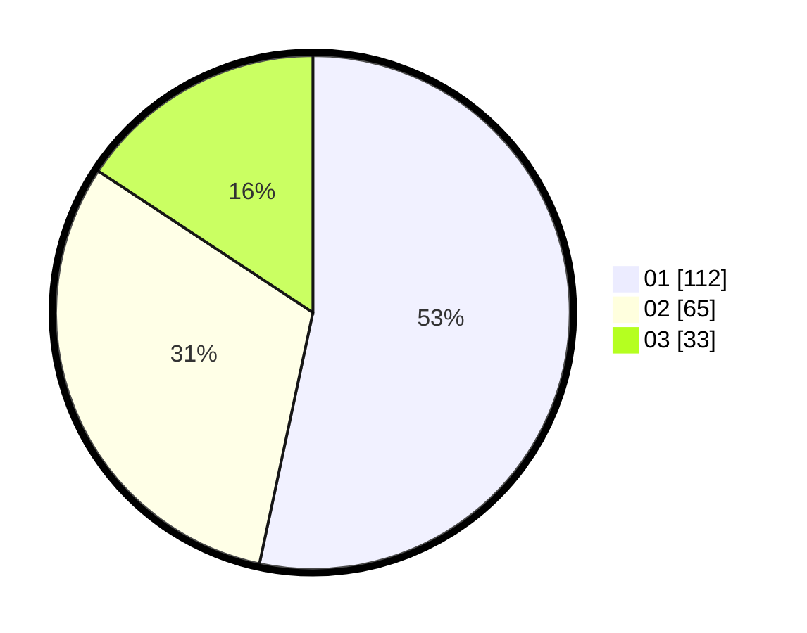

# Hasil

Hasil perolehan suara paslon dapat dilihat pada file paslon-01.txt, paslon-02.txt, dan paslon-03.txt.

Jika tidak ada, artinya data tersebut belum ada pada SIREKAP.

## Perolehan Suara

 * Paslon 01: **112**.
 * Paslon 02: **65**.
 * Paslon 03: **33**.

## Foto C Plano

https://sirekap-obj-formc.kpu.go.id/1890/pemilu/ppwp/31/73/05/10/03/3173051003030-20240214-220444--83dbafba-e03e-49f4-a3c9-40a14f61cf24.jpg

https://sirekap-obj-formc.kpu.go.id/1890/pemilu/ppwp/31/73/05/10/03/3173051003030-20240214-220528--db410e07-dc02-4da2-865a-b5c1a99a85d2.jpg

https://sirekap-obj-formc.kpu.go.id/1890/pemilu/ppwp/31/73/05/10/03/3173051003030-20240214-220629--4b7ed4c1-7037-4257-9af6-ea9bb17d1caa.jpg
