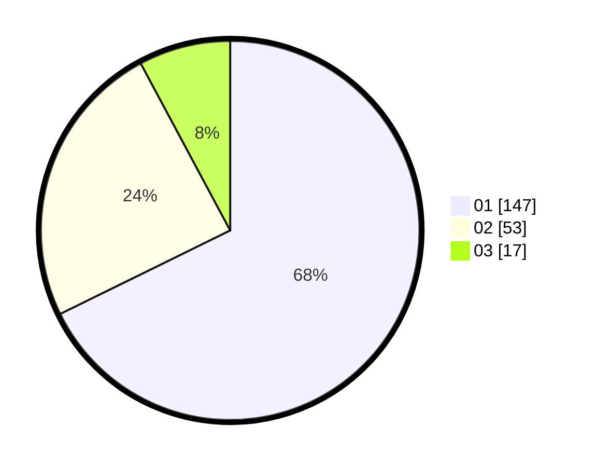

# Hasil

Hasil perolehan suara paslon dapat dilihat pada file paslon-01.txt, paslon-02.txt, dan paslon-03.txt.

Jika tidak ada, artinya data tersebut belum ada pada SIREKAP.

## Perolehan Suara

 * Paslon 01: **147**.
 * Paslon 02: **53**.
 * Paslon 03: **17**.

## Foto C Plano

https://sirekap-obj-formc.kpu.go.id/c932/pemilu/ppwp/31/73/05/10/03/3173051003031-20240215-020344--7daea261-e982-4b9e-8213-d3f772ab7bab.jpg

https://sirekap-obj-formc.kpu.go.id/c932/pemilu/ppwp/31/73/05/10/03/3173051003031-20240215-020439--9e976815-d743-4986-aa35-8ecdee95545a.jpg

https://sirekap-obj-formc.kpu.go.id/c932/pemilu/ppwp/31/73/05/10/03/3173051003031-20240215-020746--2e3fad99-6e41-4ba2-b3ef-de2f7b69bc34.jpg

## DATA PEMILIH TETAP

Jumlah pemilih dalam DPT: **267**.
 * L: **136**.
 * P: **131**.

## DATA PENGGUNA HAK PILIH

Jumlah pengguna hak pilih dalam DPT: **222**.
 * L: **110**.
 * P: **112**.

Jumlah pengguna hak pilih dalam DPTb: **0**.
 * L: **0**.
 * P: **0**.

Jumlah pengguna hak pilih dalam DPK: **1**.
 * L: **0**.
 * P: **1**.

Jumlah pengguna hak pilih: **223**.
 * L: **110**.
 * P: **113**.

## JUMLAH SUARA SAH DAN TIDAK SAH

JUMLAH SELURUH SUARA SAH: **217**.

JUMLAH SUARA TIDAK SAH: **6**.

JUMLAH SELURUH SUARA SAH DAN SUARA TIDAK SAH: **223**.
