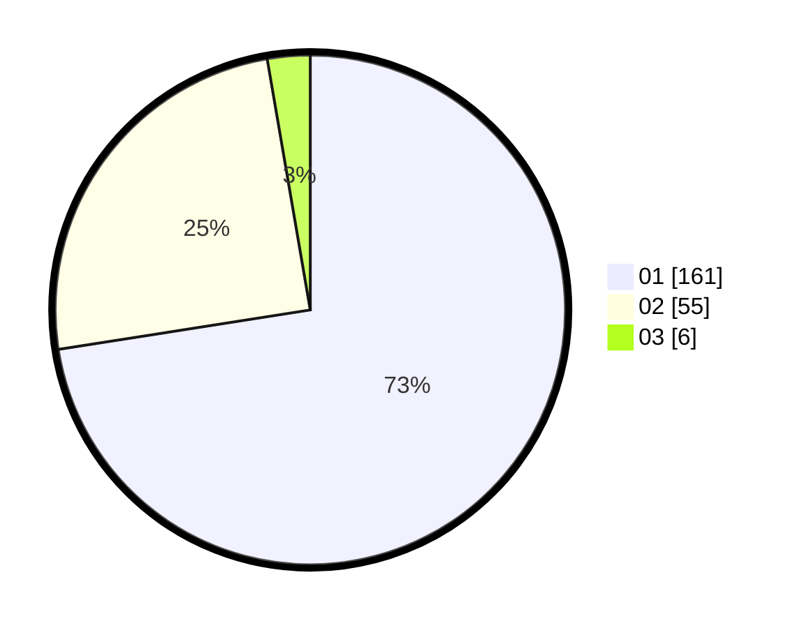

# Hasil

Hasil perolehan suara paslon dapat dilihat pada file paslon-01.txt, paslon-02.txt, dan paslon-03.txt.

Jika tidak ada, artinya data tersebut belum ada pada SIREKAP.

## Perolehan Suara

 * Paslon 01: **161**.
 * Paslon 02: **55**.
 * Paslon 03: **6**.

## Foto C Plano

https://sirekap-obj-formc.kpu.go.id/3277/pemilu/ppwp/31/73/05/10/03/3173051003034-20240214-155303--c91db1a9-52fb-4927-bf8f-bd4557ba2c04.jpg

https://sirekap-obj-formc.kpu.go.id/3277/pemilu/ppwp/31/73/05/10/03/3173051003034-20240214-212917--464e4b16-ceff-4b21-878c-3be1b52b85d1.jpg

https://sirekap-obj-formc.kpu.go.id/3277/pemilu/ppwp/31/73/05/10/03/3173051003034-20240214-213232--4eac30f6-5877-42f8-b145-15c1e3a1c49f.jpg

## DATA PEMILIH TETAP

Jumlah pemilih dalam DPT: **265**.
 * L: **123**.
 * P: **142**.

## DATA PENGGUNA HAK PILIH

Jumlah pengguna hak pilih dalam DPT: **212**.
 * L: **97**.
 * P: **115**.

Jumlah pengguna hak pilih dalam DPTb: **2**.
 * L: **1**.
 * P: **1**.

Jumlah pengguna hak pilih dalam DPK: **11**.
 * L: **4**.
 * P: **7**.

Jumlah pengguna hak pilih: **225**.
 * L: **102**.
 * P: **123**.

## JUMLAH SUARA SAH DAN TIDAK SAH

JUMLAH SELURUH SUARA SAH: **222**.

JUMLAH SUARA TIDAK SAH: **3**.

JUMLAH SELURUH SUARA SAH DAN SUARA TIDAK SAH: **225**.
