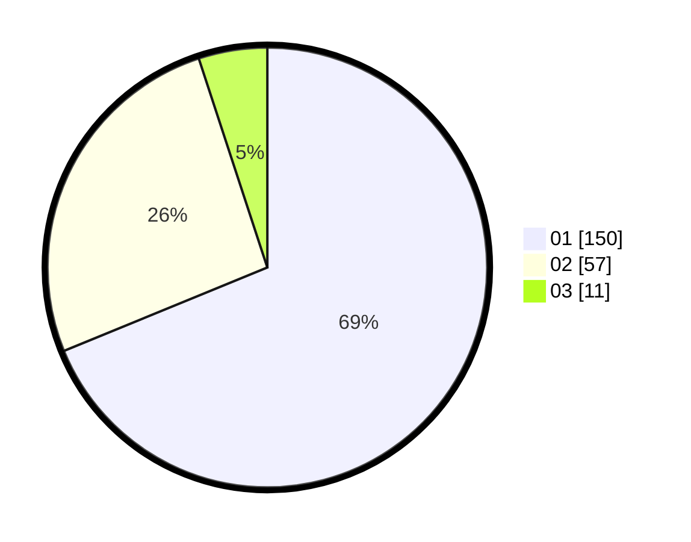

# Hasil

Hasil perolehan suara paslon dapat dilihat pada file paslon-01.txt, paslon-02.txt, dan paslon-03.txt.

Jika tidak ada, artinya data tersebut belum ada pada SIREKAP.

## Perolehan Suara

 * Paslon 01: **150**.
 * Paslon 02: **57**.
 * Paslon 03: **11**.

## Foto C Plano

https://sirekap-obj-formc.kpu.go.id/42fd/pemilu/ppwp/31/73/05/10/03/3173051003035-20240214-222626--1a60f9ec-5333-4823-9979-9b68c75124fd.jpg

https://sirekap-obj-formc.kpu.go.id/42fd/pemilu/ppwp/31/73/05/10/03/3173051003035-20240214-222744--92991460-616c-4970-a05c-8bf5b5419046.jpg

https://sirekap-obj-formc.kpu.go.id/42fd/pemilu/ppwp/31/73/05/10/03/3173051003035-20240214-222848--fe15c52b-6805-4b22-9d64-2b42a3bd678e.jpg
