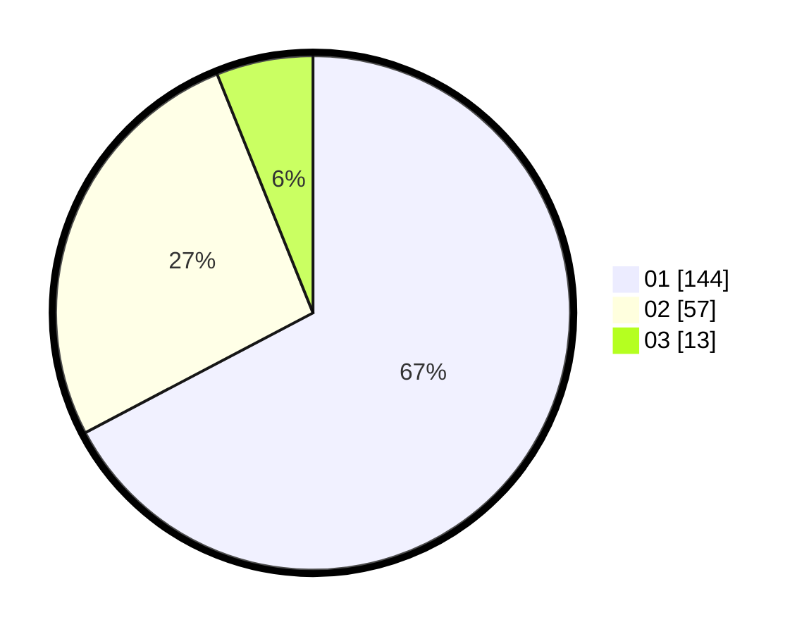

# Hasil

Hasil perolehan suara paslon dapat dilihat pada file paslon-01.txt, paslon-02.txt, dan paslon-03.txt.

Jika tidak ada, artinya data tersebut belum ada pada SIREKAP.

## Perolehan Suara

 * Paslon 01: **144**.
 * Paslon 02: **57**.
 * Paslon 03: **13**.

## Foto C Plano

https://sirekap-obj-formc.kpu.go.id/bf67/pemilu/ppwp/31/73/05/10/03/3173051003036-20240215-001729--2a0a6a3d-f36a-43d8-9c8a-718226b78d28.jpg

https://sirekap-obj-formc.kpu.go.id/bf67/pemilu/ppwp/31/73/05/10/03/3173051003036-20240215-001810--29cb30f4-4da8-40ec-bfc7-e200b7229103.jpg

https://sirekap-obj-formc.kpu.go.id/bf67/pemilu/ppwp/31/73/05/10/03/3173051003036-20240215-001913--2498567b-ac89-41e6-b4c1-c3b4297b1980.jpg
