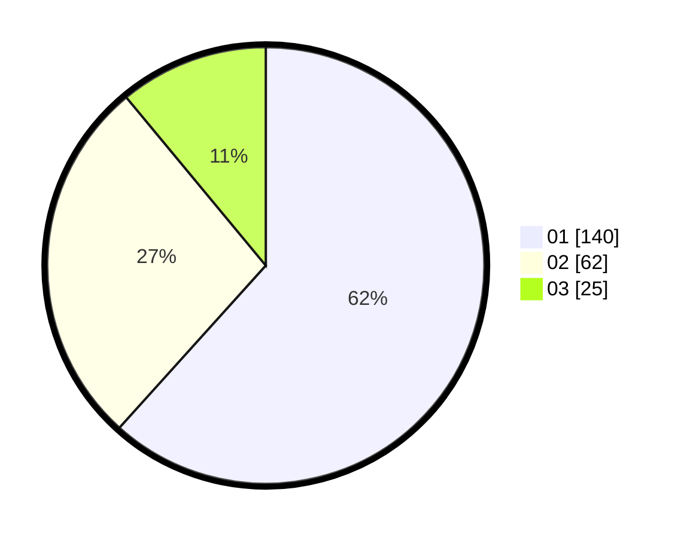

# Hasil

Hasil perolehan suara paslon dapat dilihat pada file paslon-01.txt, paslon-02.txt, dan paslon-03.txt.

Jika tidak ada, artinya data tersebut belum ada pada SIREKAP.

## Perolehan Suara

 * Paslon 01: **140**.
 * Paslon 02: **62**.
 * Paslon 03: **25**.

## Foto C Plano

https://sirekap-obj-formc.kpu.go.id/bdcb/pemilu/ppwp/31/73/05/10/03/3173051003037-20240214-231932--5256adef-c4bd-487a-b349-4235b1f9ff38.jpg

https://sirekap-obj-formc.kpu.go.id/bdcb/pemilu/ppwp/31/73/05/10/03/3173051003037-20240214-232059--4ec7a3a6-2503-4f78-acbf-31cd555d7f1b.jpg

https://sirekap-obj-formc.kpu.go.id/bdcb/pemilu/ppwp/31/73/05/10/03/3173051003037-20240214-232416--d6eee819-2aed-4712-a06e-faa88dc10541.jpg

## DATA PEMILIH TETAP

Jumlah pemilih dalam DPT: **263**.
 * L: **140**.
 * P: **123**.

## DATA PENGGUNA HAK PILIH

Jumlah pengguna hak pilih dalam DPT: **229**.
 * L: **115**.
 * P: **114**.

Jumlah pengguna hak pilih dalam DPTb: **1**.
 * L: **0**.
 * P: **1**.

Jumlah pengguna hak pilih dalam DPK: **0**.
 * L: **0**.
 * P: **0**.

Jumlah pengguna hak pilih: **230**.
 * L: **115**.
 * P: **115**.

## JUMLAH SUARA SAH DAN TIDAK SAH

JUMLAH SELURUH SUARA SAH: **227**.

JUMLAH SUARA TIDAK SAH: **3**.

JUMLAH SELURUH SUARA SAH DAN SUARA TIDAK SAH: **230**.
