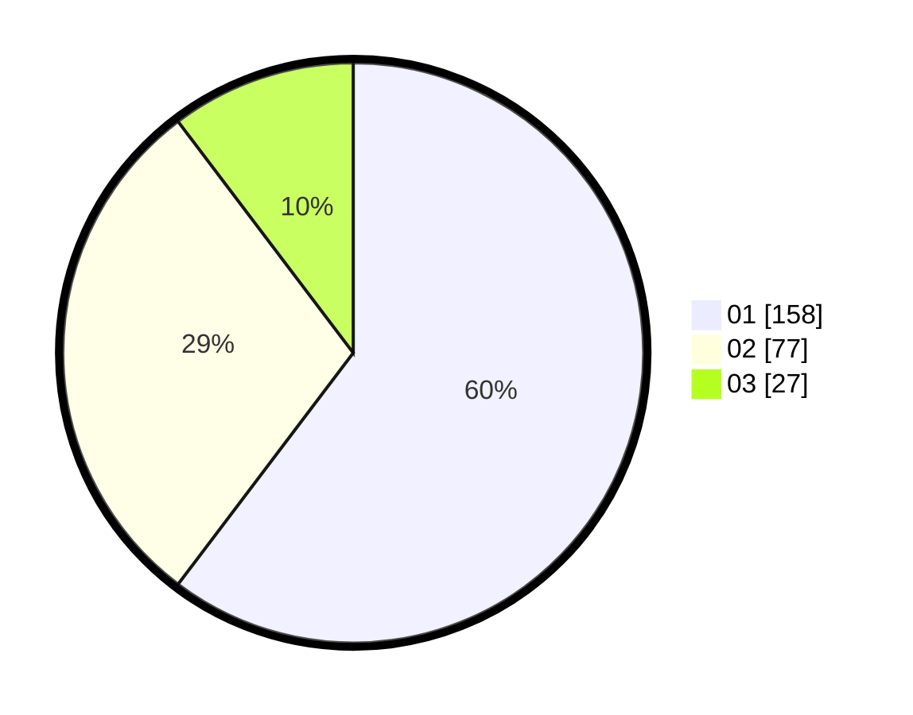

# Hasil

Hasil perolehan suara paslon dapat dilihat pada file paslon-01.txt, paslon-02.txt, dan paslon-03.txt.

Jika tidak ada, artinya data tersebut belum ada pada SIREKAP.

## Perolehan Suara

 * Paslon 01: **158**.
 * Paslon 02: **77**.
 * Paslon 03: **27**.

## Foto C Plano

https://sirekap-obj-formc.kpu.go.id/04e7/pemilu/ppwp/31/73/05/10/03/3173051003043-20240214-224025--33b2dce7-a47d-494d-8be1-e209970a416f.jpg

https://sirekap-obj-formc.kpu.go.id/04e7/pemilu/ppwp/31/73/05/10/03/3173051003043-20240214-232029--c8542d06-1680-4b80-b9b1-7ea2b2a0cdba.jpg
