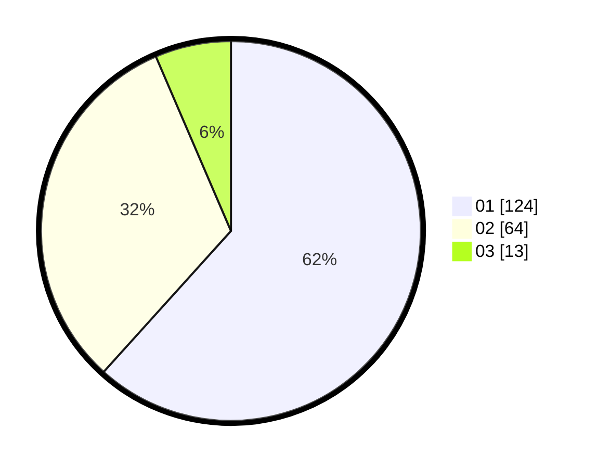

# Hasil

Hasil perolehan suara paslon dapat dilihat pada file paslon-01.txt, paslon-02.txt, dan paslon-03.txt.

Jika tidak ada, artinya data tersebut belum ada pada SIREKAP.

## Perolehan Suara

 * Paslon 01: **124**.
 * Paslon 02: **64**.
 * Paslon 03: **13**.

## Foto C Plano

https://sirekap-obj-formc.kpu.go.id/50a7/pemilu/ppwp/31/73/05/10/03/3173051003044-20240214-190145--a91cf088-bdaa-4e49-bbb7-9dd6b08e0902.jpg

https://sirekap-obj-formc.kpu.go.id/50a7/pemilu/ppwp/31/73/05/10/03/3173051003044-20240214-191653--ec688a8b-cd8c-4084-b9e3-44d561d88ab7.jpg

https://sirekap-obj-formc.kpu.go.id/50a7/pemilu/ppwp/31/73/05/10/03/3173051003044-20240214-190424--1a819b0e-fb57-4145-8f35-73fc10b3d97c.jpg

## DATA PEMILIH TETAP

Jumlah pemilih dalam DPT: **279**.
 * L: **136**.
 * P: **143**.

## DATA PENGGUNA HAK PILIH

Jumlah pengguna hak pilih dalam DPT: **201**.
 * L: **91**.
 * P: **110**.

Jumlah pengguna hak pilih dalam DPTb: **0**.
 * L: **0**.
 * P: **0**.

Jumlah pengguna hak pilih dalam DPK: **2**.
 * L: **1**.
 * P: **1**.

Jumlah pengguna hak pilih: **203**.
 * L: **92**.
 * P: **111**.

## JUMLAH SUARA SAH DAN TIDAK SAH

JUMLAH SELURUH SUARA SAH: **201**.

JUMLAH SUARA TIDAK SAH: **2**.

JUMLAH SELURUH SUARA SAH DAN SUARA TIDAK SAH: **203**.
