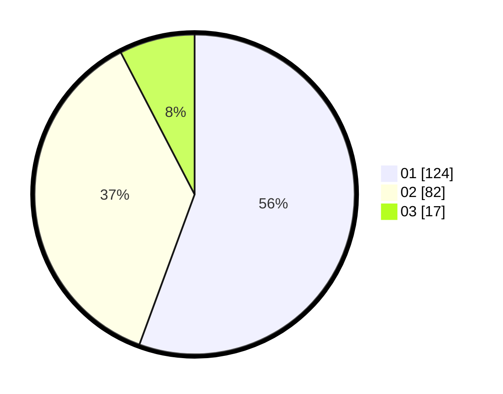

# Hasil

Hasil perolehan suara paslon dapat dilihat pada file paslon-01.txt, paslon-02.txt, dan paslon-03.txt.

Jika tidak ada, artinya data tersebut belum ada pada SIREKAP.

## Perolehan Suara

 * Paslon 01: **124**.
 * Paslon 02: **82**.
 * Paslon 03: **17**.

## Foto C Plano

https://sirekap-obj-formc.kpu.go.id/facf/pemilu/ppwp/31/73/05/10/03/3173051003045-20240215-002940--845b72c0-5a23-4af6-9f91-fb8783650af8.jpg

https://sirekap-obj-formc.kpu.go.id/facf/pemilu/ppwp/31/73/05/10/03/3173051003045-20240215-003052--744178c9-f1b9-4ab4-9952-ac264515e759.jpg

https://sirekap-obj-formc.kpu.go.id/facf/pemilu/ppwp/31/73/05/10/03/3173051003045-20240215-003158--1ed3d68f-ce24-4406-bd70-550eeaf62724.jpg
