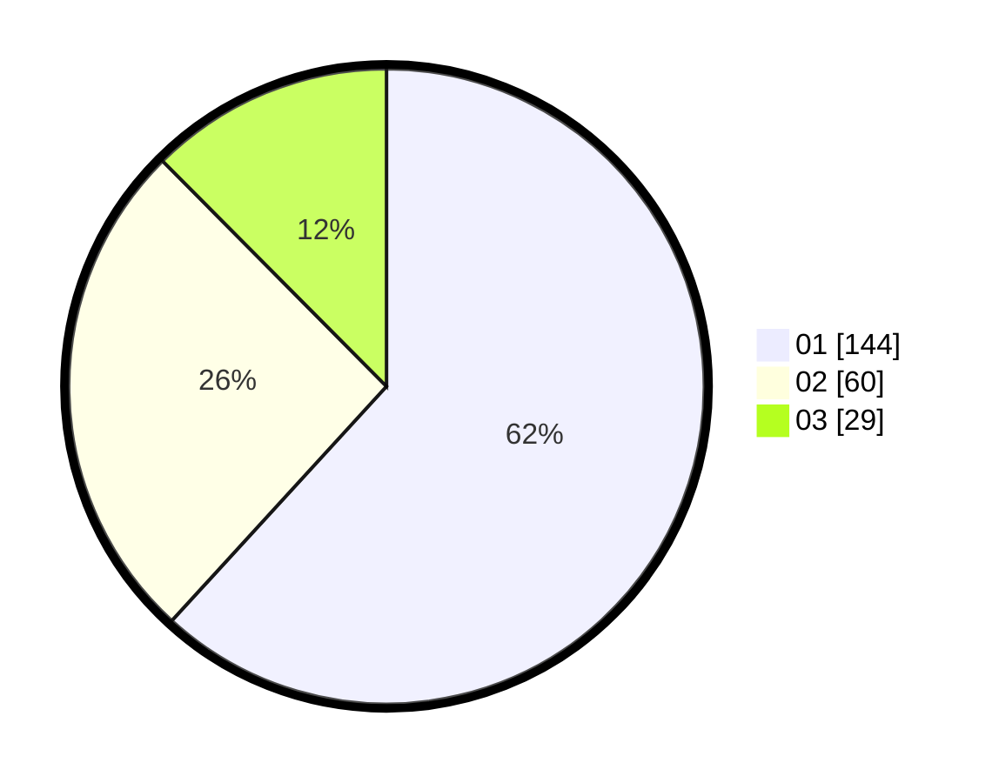

# Hasil

Hasil perolehan suara paslon dapat dilihat pada file paslon-01.txt, paslon-02.txt, dan paslon-03.txt.

Jika tidak ada, artinya data tersebut belum ada pada SIREKAP.

## Perolehan Suara

 * Paslon 01: **144**.
 * Paslon 02: **60**.
 * Paslon 03: **29**.

## Foto C Plano

https://sirekap-obj-formc.kpu.go.id/885c/pemilu/ppwp/31/73/05/10/03/3173051003046-20240214-213019--240f68da-d302-49e9-bc6e-f27c1deadde3.jpg

https://sirekap-obj-formc.kpu.go.id/885c/pemilu/ppwp/31/73/05/10/03/3173051003046-20240214-213203--90a94dfa-a326-41f4-b865-be2925b0c8e0.jpg

https://sirekap-obj-formc.kpu.go.id/885c/pemilu/ppwp/31/73/05/10/03/3173051003046-20240214-213812--7b32c470-e283-422d-93b3-c297f6f37d64.jpg

## DATA PEMILIH TETAP

Jumlah pemilih dalam DPT: **279**.
 * L: **142**.
 * P: **137**.

## DATA PENGGUNA HAK PILIH

Jumlah pengguna hak pilih dalam DPT: **233**.
 * L: **117**.
 * P: **116**.

Jumlah pengguna hak pilih dalam DPTb: **1**.
 * L: **0**.
 * P: **1**.

Jumlah pengguna hak pilih dalam DPK: **1**.
 * L: **1**.
 * P: **0**.

Jumlah pengguna hak pilih: **235**.
 * L: **118**.
 * P: **117**.

## JUMLAH SUARA SAH DAN TIDAK SAH

JUMLAH SELURUH SUARA SAH: **233**.

JUMLAH SUARA TIDAK SAH: **2**.

JUMLAH SELURUH SUARA SAH DAN SUARA TIDAK SAH: **235**.
