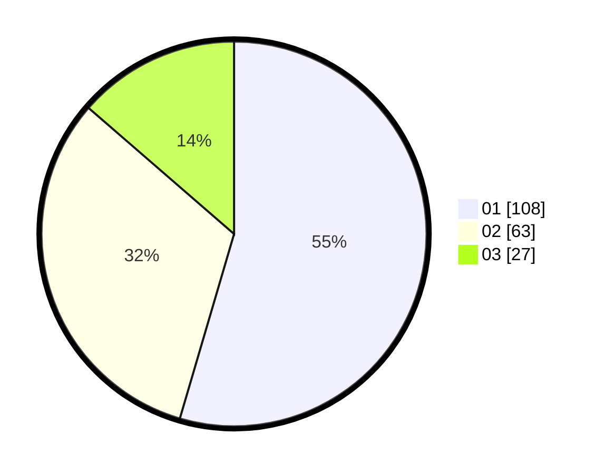

# Hasil

Hasil perolehan suara paslon dapat dilihat pada file paslon-01.txt, paslon-02.txt, dan paslon-03.txt.

Jika tidak ada, artinya data tersebut belum ada pada SIREKAP.

## Perolehan Suara

 * Paslon 01: **108**.
 * Paslon 02: **63**.
 * Paslon 03: **27**.

## Foto C Plano

https://sirekap-obj-formc.kpu.go.id/ea95/pemilu/ppwp/31/73/05/10/03/3173051003056-20240214-155303--c9cea8b8-8f37-4091-8aa5-1f5122ca43e6.jpg

https://sirekap-obj-formc.kpu.go.id/ea95/pemilu/ppwp/31/73/05/10/03/3173051003056-20240214-155328--5b3b2e7e-c36b-44ba-bbba-509803caff15.jpg

https://sirekap-obj-formc.kpu.go.id/ea95/pemilu/ppwp/31/73/05/10/03/3173051003056-20240214-155655--ea32859e-502e-41c3-b704-d2420b278e0e.jpg

## DATA PEMILIH TETAP

Jumlah pemilih dalam DPT: **256**.
 * L: **133**.
 * P: **123**.

## DATA PENGGUNA HAK PILIH

Jumlah pengguna hak pilih dalam DPT: **181**.
 * L: **90**.
 * P: **91**.

Jumlah pengguna hak pilih dalam DPTb: **14**.
 * L: **6**.
 * P: **8**.

Jumlah pengguna hak pilih dalam DPK: **5**.
 * L: **3**.
 * P: **2**.

Jumlah pengguna hak pilih: **200**.
 * L: **99**.
 * P: **101**.

## JUMLAH SUARA SAH DAN TIDAK SAH

JUMLAH SELURUH SUARA SAH: **198**.

JUMLAH SUARA TIDAK SAH: **2**.

JUMLAH SELURUH SUARA SAH DAN SUARA TIDAK SAH: **200**.
