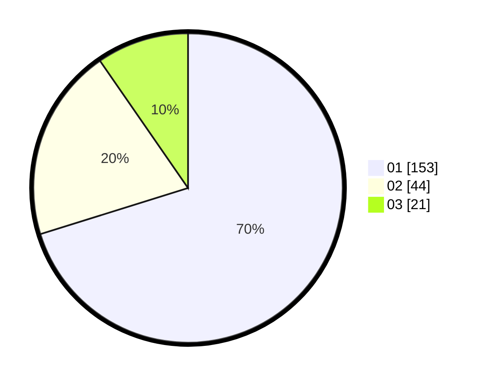

# Hasil

Hasil perolehan suara paslon dapat dilihat pada file paslon-01.txt, paslon-02.txt, dan paslon-03.txt.

Jika tidak ada, artinya data tersebut belum ada pada SIREKAP.

## Perolehan Suara

 * Paslon 01: **153**.
 * Paslon 02: **44**.
 * Paslon 03: **21**.

## Foto C Plano

https://sirekap-obj-formc.kpu.go.id/3ea5/pemilu/ppwp/31/73/05/10/03/3173051003063-20240215-012351--1e211126-b906-4d75-9d28-077cae753d1e.jpg

https://sirekap-obj-formc.kpu.go.id/3ea5/pemilu/ppwp/31/73/05/10/03/3173051003063-20240215-012846--01648d1b-ae51-46ea-ad88-64193a535108.jpg

https://sirekap-obj-formc.kpu.go.id/3ea5/pemilu/ppwp/31/73/05/10/03/3173051003063-20240215-013025--8d140028-e7bf-439c-b64d-66401b39af3f.jpg
