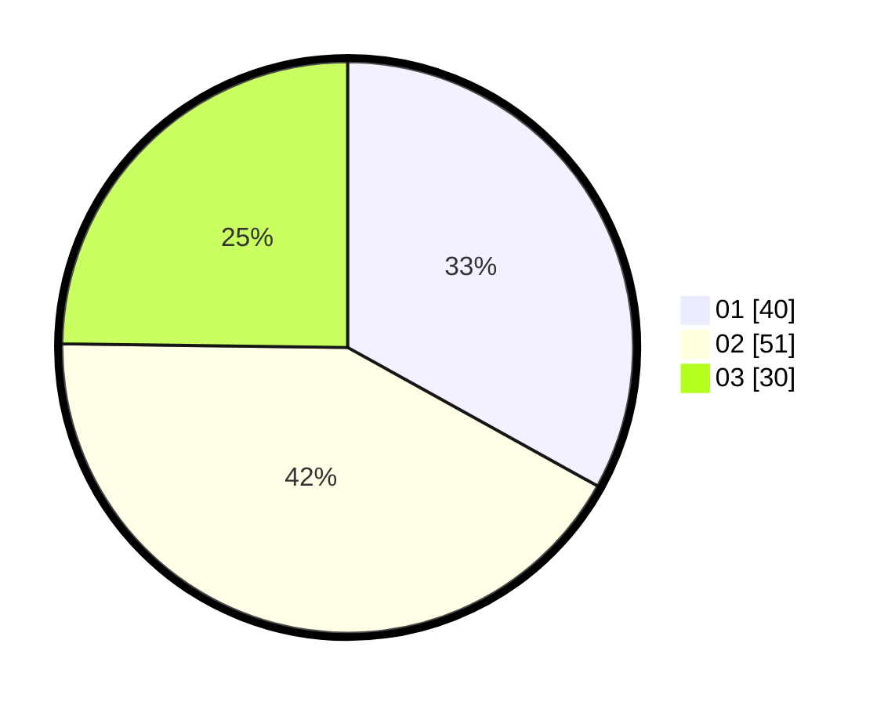

# Hasil

Hasil perolehan suara paslon dapat dilihat pada file paslon-01.txt, paslon-02.txt, dan paslon-03.txt.

Jika tidak ada, artinya data tersebut belum ada pada SIREKAP.

## Perolehan Suara

 * Paslon 01: **40**.
 * Paslon 02: **51**.
 * Paslon 03: **30**.

## Foto C Plano

https://sirekap-obj-formc.kpu.go.id/68da/pemilu/ppwp/31/73/05/10/03/3173051003065-20240215-185048--1b92f082-ede1-4fec-8333-199c7e769d36.jpg

https://sirekap-obj-formc.kpu.go.id/68da/pemilu/ppwp/31/73/05/10/03/3173051003065-20240215-185110--4937fe1e-69d0-4d0d-b3e7-4bc0cbdc3916.jpg

https://sirekap-obj-formc.kpu.go.id/68da/pemilu/ppwp/31/73/05/10/03/3173051003065-20240215-185059--ccba94ae-1f2b-43f8-854f-27f49f9f929e.jpg

## DATA PEMILIH TETAP

Jumlah pemilih dalam DPT: **173**.
 * L: **86**.
 * P: **87**.

## DATA PENGGUNA HAK PILIH

Jumlah pengguna hak pilih dalam DPT: **123**.
 * L: **58**.
 * P: **65**.

Jumlah pengguna hak pilih dalam DPTb: **0**.
 * L: **0**.
 * P: **0**.

Jumlah pengguna hak pilih dalam DPK: **0**.
 * L: **0**.
 * P: **0**.

Jumlah pengguna hak pilih: **123**.
 * L: **58**.
 * P: **65**.

## JUMLAH SUARA SAH DAN TIDAK SAH

JUMLAH SELURUH SUARA SAH: **121**.

JUMLAH SUARA TIDAK SAH: **2**.

JUMLAH SELURUH SUARA SAH DAN SUARA TIDAK SAH: **123**.
