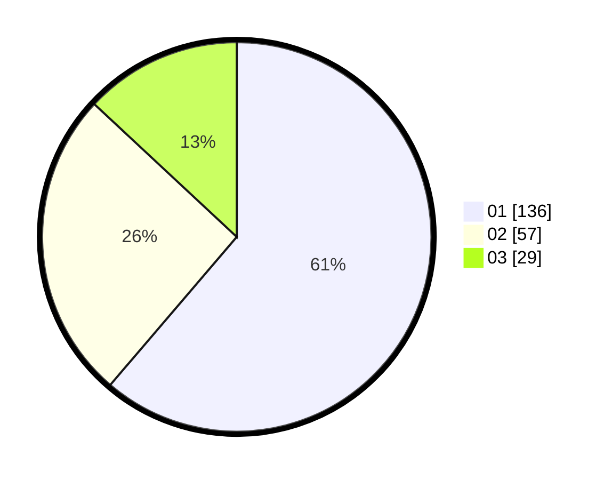

# Hasil

Hasil perolehan suara paslon dapat dilihat pada file paslon-01.txt, paslon-02.txt, dan paslon-03.txt.

Jika tidak ada, artinya data tersebut belum ada pada SIREKAP.

## Perolehan Suara

 * Paslon 01: **136**.
 * Paslon 02: **57**.
 * Paslon 03: **29**.

## Foto C Plano

https://sirekap-obj-formc.kpu.go.id/2f29/pemilu/ppwp/31/73/05/10/03/3173051003068-20240214-202857--b2736629-fbc8-4a02-8a02-db68cff9d678.jpg

https://sirekap-obj-formc.kpu.go.id/2f29/pemilu/ppwp/31/73/05/10/03/3173051003068-20240214-202905--4346113e-2429-45a6-8012-06aa8a2b4c40.jpg

https://sirekap-obj-formc.kpu.go.id/2f29/pemilu/ppwp/31/73/05/10/03/3173051003068-20240216-024720--8c6df52f-516f-4f8f-a479-e429a4a7e897.jpg

## DATA PEMILIH TETAP

Jumlah pemilih dalam DPT: **247**.
 * L: **120**.
 * P: **127**.

## DATA PENGGUNA HAK PILIH

Jumlah pengguna hak pilih dalam DPT: **209**.
 * L: **98**.
 * P: **111**.

Jumlah pengguna hak pilih dalam DPTb: **11**.
 * L: **4**.
 * P: **7**.

Jumlah pengguna hak pilih dalam DPK: **3**.
 * L: **1**.
 * P: **2**.

Jumlah pengguna hak pilih: **223**.
 * L: **103**.
 * P: **120**.

## JUMLAH SUARA SAH DAN TIDAK SAH

JUMLAH SELURUH SUARA SAH: **222**.

JUMLAH SUARA TIDAK SAH: **1**.

JUMLAH SELURUH SUARA SAH DAN SUARA TIDAK SAH: **223**.
