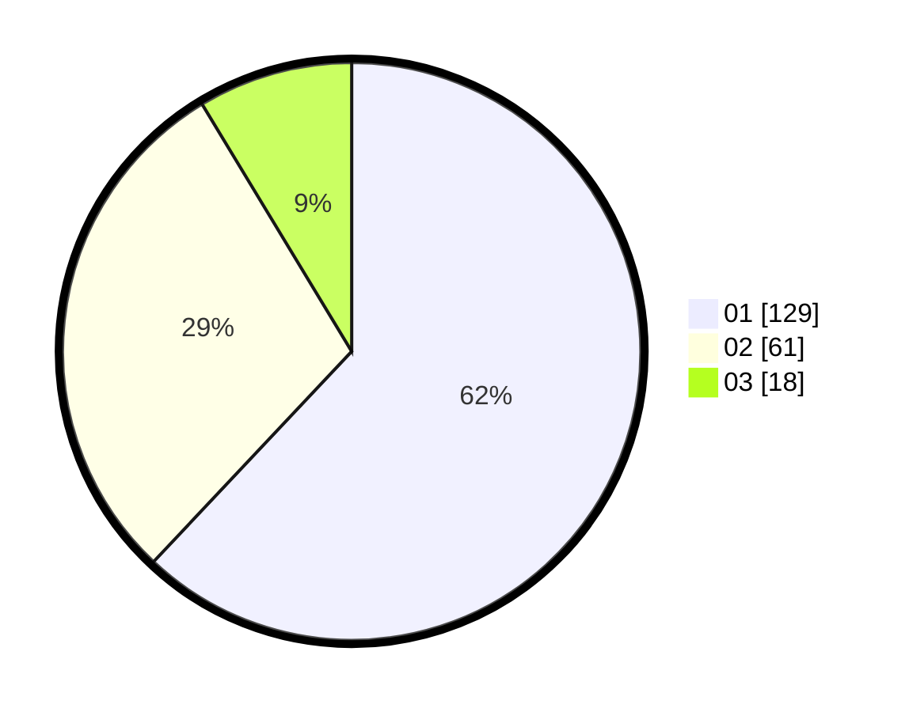

# Hasil

Hasil perolehan suara paslon dapat dilihat pada file paslon-01.txt, paslon-02.txt, dan paslon-03.txt.

Jika tidak ada, artinya data tersebut belum ada pada SIREKAP.

## Perolehan Suara

 * Paslon 01: **129**.
 * Paslon 02: **61**.
 * Paslon 03: **18**.

## Foto C Plano

https://sirekap-obj-formc.kpu.go.id/6ae3/pemilu/ppwp/31/73/05/10/03/3173051003070-20240215-003110--f8162a82-dcb3-40e1-844f-a562d9715007.jpg

https://sirekap-obj-formc.kpu.go.id/6ae3/pemilu/ppwp/31/73/05/10/03/3173051003070-20240215-025148--da30777c-49a8-478b-ad27-f55845ec7505.jpg

https://sirekap-obj-formc.kpu.go.id/6ae3/pemilu/ppwp/31/73/05/10/03/3173051003070-20240214-231000--f79746fd-3a79-4fbb-ba75-dd8f21103b6d.jpg

## DATA PEMILIH TETAP

Jumlah pemilih dalam DPT: **266**.
 * L: **131**.
 * P: **135**.

## DATA PENGGUNA HAK PILIH

Jumlah pengguna hak pilih dalam DPT: **209**.
 * L: **100**.
 * P: **109**.

Jumlah pengguna hak pilih dalam DPTb: **1**.
 * L: **1**.
 * P: **0**.

Jumlah pengguna hak pilih dalam DPK: **0**.
 * L: **0**.
 * P: **0**.

Jumlah pengguna hak pilih: **210**.
 * L: **101**.
 * P: **109**.

## JUMLAH SUARA SAH DAN TIDAK SAH

JUMLAH SELURUH SUARA SAH: **208**.

JUMLAH SUARA TIDAK SAH: **2**.

JUMLAH SELURUH SUARA SAH DAN SUARA TIDAK SAH: **210**.
