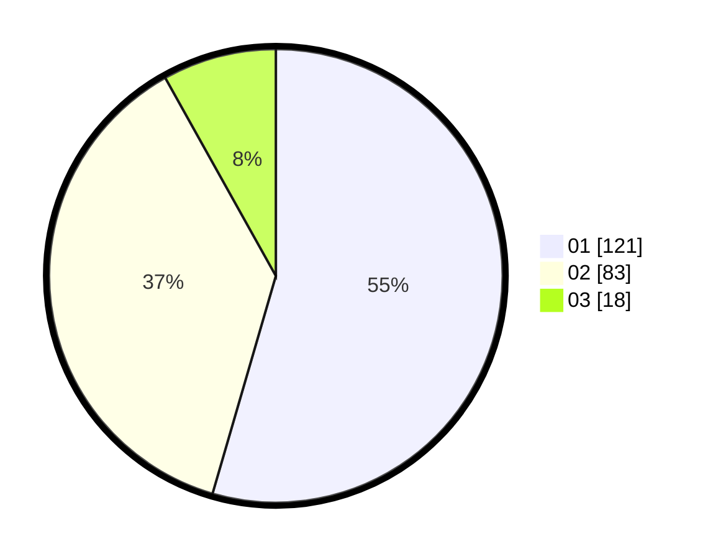

# Hasil

Hasil perolehan suara paslon dapat dilihat pada file paslon-01.txt, paslon-02.txt, dan paslon-03.txt.

Jika tidak ada, artinya data tersebut belum ada pada SIREKAP.

## Perolehan Suara

 * Paslon 01: **121**.
 * Paslon 02: **83**.
 * Paslon 03: **18**.

## Foto C Plano

https://sirekap-obj-formc.kpu.go.id/6305/pemilu/ppwp/31/73/05/10/03/3173051003071-20240216-084325--3da5972b-2a73-40a2-ad14-48132cb2ec8c.jpg

https://sirekap-obj-formc.kpu.go.id/6305/pemilu/ppwp/31/73/05/10/03/3173051003071-20240216-171624--6b092912-cc0c-4c70-93d0-f9dc7d64411e.jpg

https://sirekap-obj-formc.kpu.go.id/6305/pemilu/ppwp/31/73/05/10/03/3173051003071-20240216-171623--62a7e6d9-3eed-4726-b220-ac4087104502.jpg

## DATA PEMILIH TETAP

Jumlah pemilih dalam DPT: **267**.
 * L: **147**.
 * P: **120**.

## DATA PENGGUNA HAK PILIH

Jumlah pengguna hak pilih dalam DPT: **226**.
 * L: **123**.
 * P: **103**.

Jumlah pengguna hak pilih dalam DPTb: **0**.
 * L: **0**.
 * P: **0**.

Jumlah pengguna hak pilih dalam DPK: **0**.
 * L: **0**.
 * P: **0**.

Jumlah pengguna hak pilih: **226**.
 * L: **123**.
 * P: **103**.

## JUMLAH SUARA SAH DAN TIDAK SAH

JUMLAH SELURUH SUARA SAH: **222**.

JUMLAH SUARA TIDAK SAH: **4**.

JUMLAH SELURUH SUARA SAH DAN SUARA TIDAK SAH: **226**.
