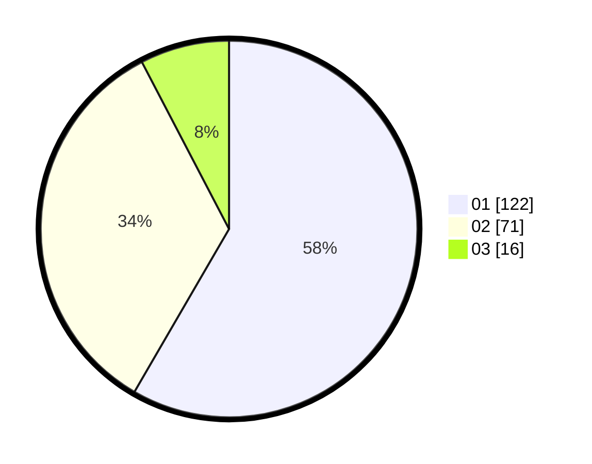

# Hasil

Hasil perolehan suara paslon dapat dilihat pada file paslon-01.txt, paslon-02.txt, dan paslon-03.txt.

Jika tidak ada, artinya data tersebut belum ada pada SIREKAP.

## Perolehan Suara

 * Paslon 01: **122**.
 * Paslon 02: **71**.
 * Paslon 03: **16**.

## Foto C Plano

https://sirekap-obj-formc.kpu.go.id/617e/pemilu/ppwp/31/73/05/10/03/3173051003072-20240215-010343--56275103-236a-468f-8c47-ab8a7ae88cf9.jpg

https://sirekap-obj-formc.kpu.go.id/617e/pemilu/ppwp/31/73/05/10/03/3173051003072-20240215-010547--45c7136e-d2cc-4cf3-8586-39a010fabe63.jpg

https://sirekap-obj-formc.kpu.go.id/617e/pemilu/ppwp/31/73/05/10/03/3173051003072-20240215-010826--00a6378c-26d1-4dca-917f-2cf5cfab95a4.jpg
