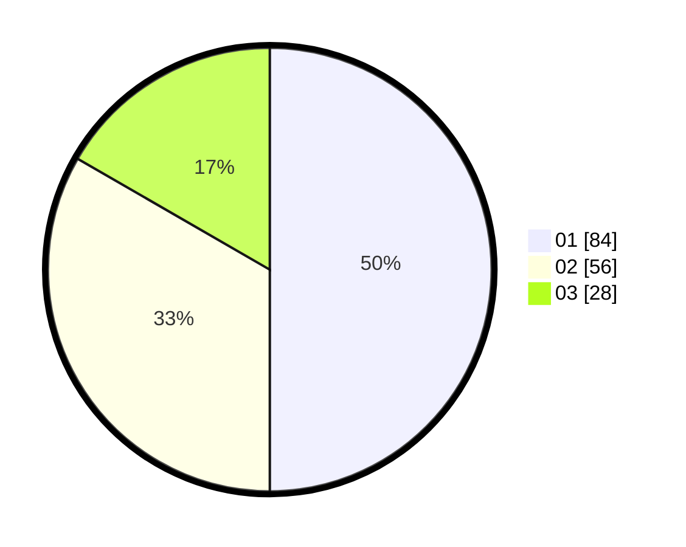

# Hasil

Hasil perolehan suara paslon dapat dilihat pada file paslon-01.txt, paslon-02.txt, dan paslon-03.txt.

Jika tidak ada, artinya data tersebut belum ada pada SIREKAP.

## Perolehan Suara

 * Paslon 01: **84**.
 * Paslon 02: **56**.
 * Paslon 03: **28**.

## Foto C Plano

https://sirekap-obj-formc.kpu.go.id/095b/pemilu/ppwp/31/73/05/10/03/3173051003075-20240215-001400--ff1fecaa-0a09-499c-80e2-600d03f2b0b8.jpg

https://sirekap-obj-formc.kpu.go.id/095b/pemilu/ppwp/31/73/05/10/03/3173051003075-20240215-001609--256d3e12-0a66-4882-a470-7ce15cfba454.jpg

https://sirekap-obj-formc.kpu.go.id/095b/pemilu/ppwp/31/73/05/10/03/3173051003075-20240215-001716--21970371-bd3c-4dfe-abb2-bf08f082c9f3.jpg
