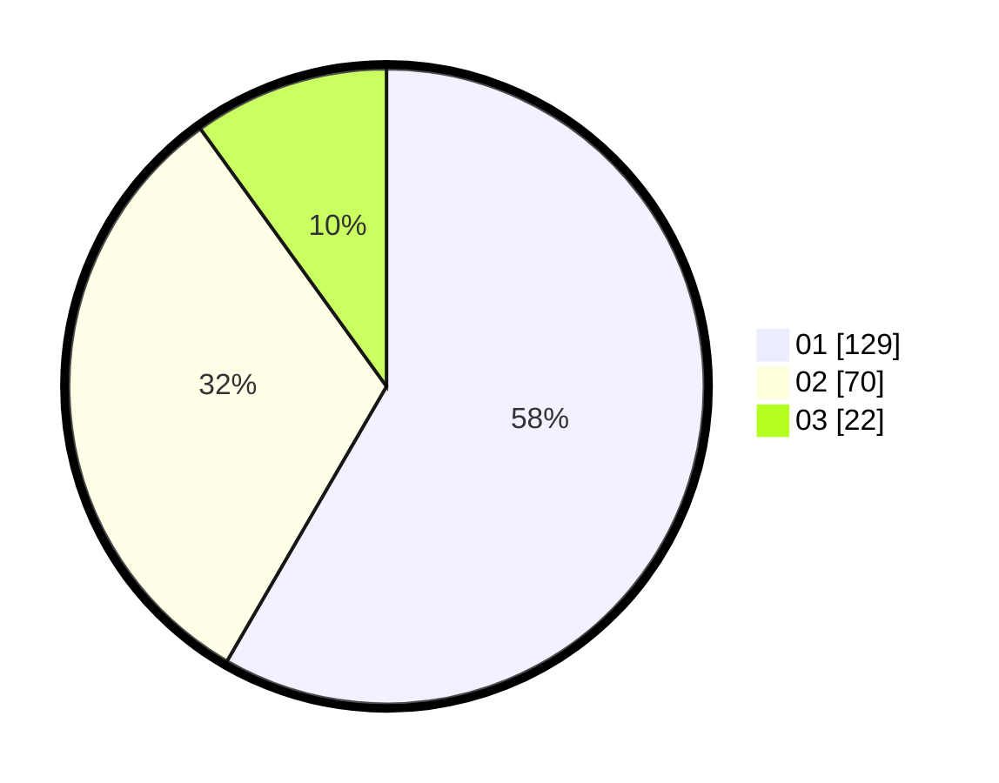

# Hasil

Hasil perolehan suara paslon dapat dilihat pada file paslon-01.txt, paslon-02.txt, dan paslon-03.txt.

Jika tidak ada, artinya data tersebut belum ada pada SIREKAP.

## Perolehan Suara

 * Paslon 01: **129**.
 * Paslon 02: **70**.
 * Paslon 03: **22**.

## Foto C Plano

https://sirekap-obj-formc.kpu.go.id/e987/pemilu/ppwp/31/73/05/10/03/3173051003078-20240214-202935--6f82ea82-8ed1-4a31-953b-2ef2acad3e27.jpg

https://sirekap-obj-formc.kpu.go.id/e987/pemilu/ppwp/31/73/05/10/03/3173051003078-20240214-202823--7263f928-dc61-406a-8835-f2150ce6406e.jpg

https://sirekap-obj-formc.kpu.go.id/e987/pemilu/ppwp/31/73/05/10/03/3173051003078-20240214-203023--6841c26b-3bd3-470b-97d0-1805d6ab0b08.jpg

## DATA PEMILIH TETAP

Jumlah pemilih dalam DPT: **277**.
 * L: **142**.
 * P: **135**.

## DATA PENGGUNA HAK PILIH

Jumlah pengguna hak pilih dalam DPT: **227**.
 * L: **112**.
 * P: **115**.

Jumlah pengguna hak pilih dalam DPTb: **0**.
 * L: **0**.
 * P: **0**.

Jumlah pengguna hak pilih dalam DPK: **1**.
 * L: **1**.
 * P: **0**.

Jumlah pengguna hak pilih: **228**.
 * L: **113**.
 * P: **115**.

## JUMLAH SUARA SAH DAN TIDAK SAH

JUMLAH SELURUH SUARA SAH: **221**.

JUMLAH SUARA TIDAK SAH: **7**.

JUMLAH SELURUH SUARA SAH DAN SUARA TIDAK SAH: **228**.
