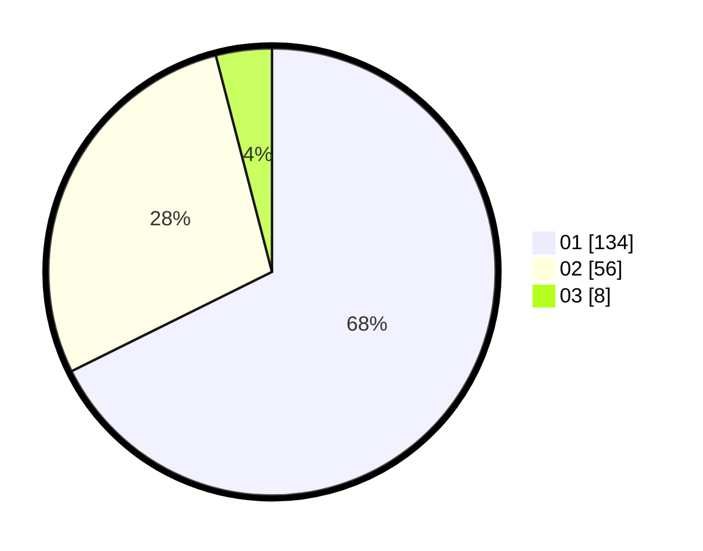

# Hasil

Hasil perolehan suara paslon dapat dilihat pada file paslon-01.txt, paslon-02.txt, dan paslon-03.txt.

Jika tidak ada, artinya data tersebut belum ada pada SIREKAP.

## Perolehan Suara

 * Paslon 01: **134**.
 * Paslon 02: **56**.
 * Paslon 03: **8**.

## Foto C Plano

https://sirekap-obj-formc.kpu.go.id/efee/pemilu/ppwp/31/73/05/10/03/3173051003081-20240215-000339--25bc8a52-a426-439a-ae31-b700b9b6bd29.jpg

https://sirekap-obj-formc.kpu.go.id/efee/pemilu/ppwp/31/73/05/10/03/3173051003081-20240215-000503--c2832636-05e0-4c7a-acf4-d95fa4d8af09.jpg
