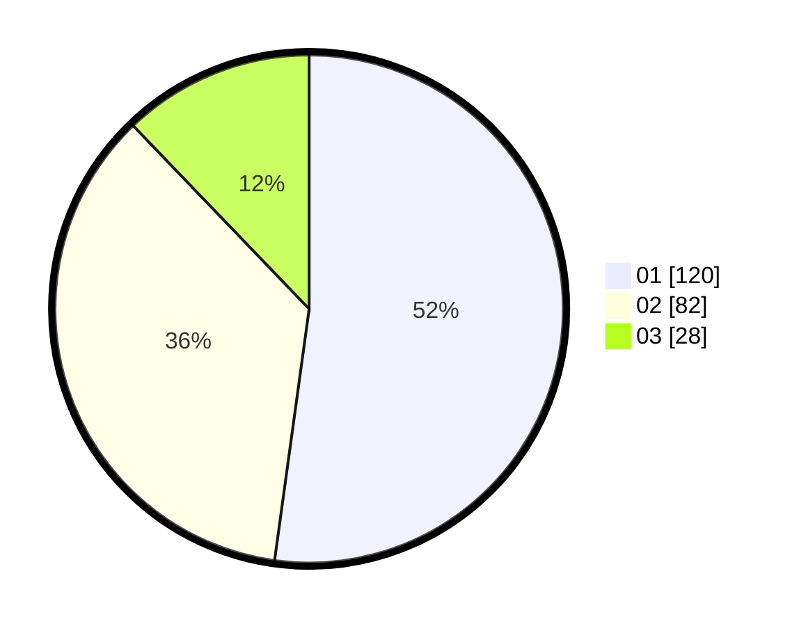

# Hasil

Hasil perolehan suara paslon dapat dilihat pada file paslon-01.txt, paslon-02.txt, dan paslon-03.txt.

Jika tidak ada, artinya data tersebut belum ada pada SIREKAP.

## Perolehan Suara

 * Paslon 01: **120**.
 * Paslon 02: **82**.
 * Paslon 03: **28**.

## Foto C Plano

https://sirekap-obj-formc.kpu.go.id/195b/pemilu/ppwp/31/73/05/10/03/3173051003086-20240214-214209--1f997495-d648-4ca0-b30a-77bb335a0096.jpg

https://sirekap-obj-formc.kpu.go.id/195b/pemilu/ppwp/31/73/05/10/03/3173051003086-20240214-204604--e7e6784c-bedb-405e-bdab-3384922cb2f0.jpg

https://sirekap-obj-formc.kpu.go.id/195b/pemilu/ppwp/31/73/05/10/03/3173051003086-20240214-214820--b1710d9d-1ad4-4471-9502-0d9aa76ba429.jpg
