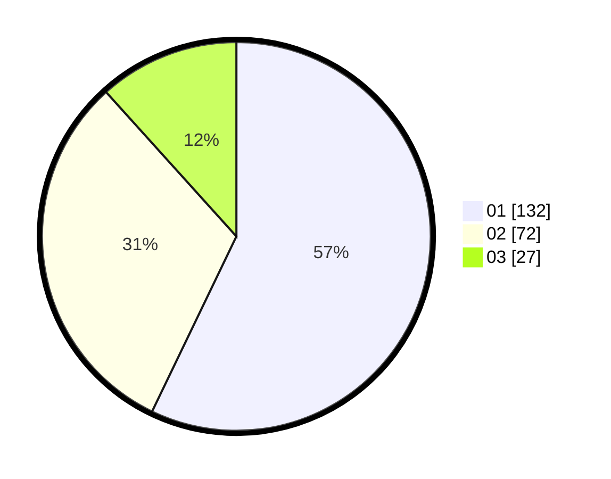

# Hasil

Hasil perolehan suara paslon dapat dilihat pada file paslon-01.txt, paslon-02.txt, dan paslon-03.txt.

Jika tidak ada, artinya data tersebut belum ada pada SIREKAP.

## Perolehan Suara

 * Paslon 01: **132**.
 * Paslon 02: **72**.
 * Paslon 03: **27**.

## Foto C Plano

https://sirekap-obj-formc.kpu.go.id/1a97/pemilu/ppwp/31/73/05/10/03/3173051003087-20240214-212045--80a902e4-16e0-4e95-8447-40cea70e91e3.jpg

https://sirekap-obj-formc.kpu.go.id/1a97/pemilu/ppwp/31/73/05/10/03/3173051003087-20240214-211908--ef78ef31-71a4-4003-992d-f50ddf9bc261.jpg

https://sirekap-obj-formc.kpu.go.id/1a97/pemilu/ppwp/31/73/05/10/03/3173051003087-20240214-204739--6da46786-76b1-4fbc-a83b-597060d91b84.jpg
