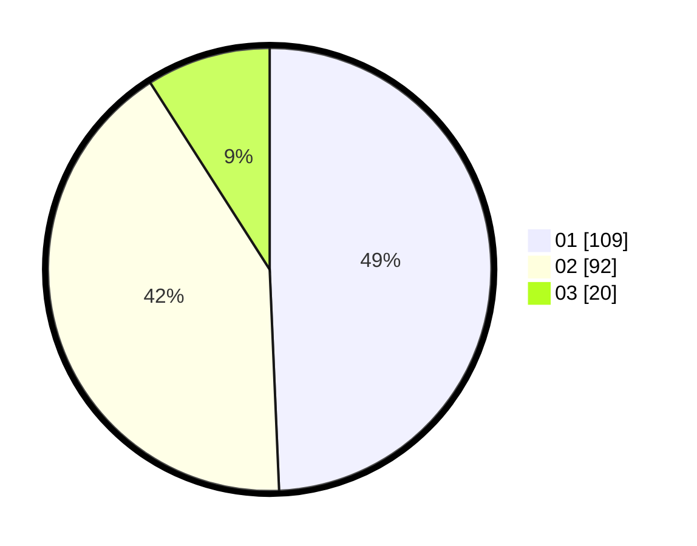

# Hasil

Hasil perolehan suara paslon dapat dilihat pada file paslon-01.txt, paslon-02.txt, dan paslon-03.txt.

Jika tidak ada, artinya data tersebut belum ada pada SIREKAP.

## Perolehan Suara

 * Paslon 01: **109**.
 * Paslon 02: **92**.
 * Paslon 03: **20**.

## Foto C Plano

https://sirekap-obj-formc.kpu.go.id/aaa8/pemilu/ppwp/31/73/05/10/03/3173051003091-20240214-213422--b11092c3-9250-4347-a9fc-7b419d6b1c52.jpg

https://sirekap-obj-formc.kpu.go.id/aaa8/pemilu/ppwp/31/73/05/10/03/3173051003091-20240214-213852--11de10fd-86ef-4ecc-9ea8-8acdf94feaa8.jpg

https://sirekap-obj-formc.kpu.go.id/aaa8/pemilu/ppwp/31/73/05/10/03/3173051003091-20240214-195923--752d3413-df9f-4d88-b943-4b70d19953ec.jpg
