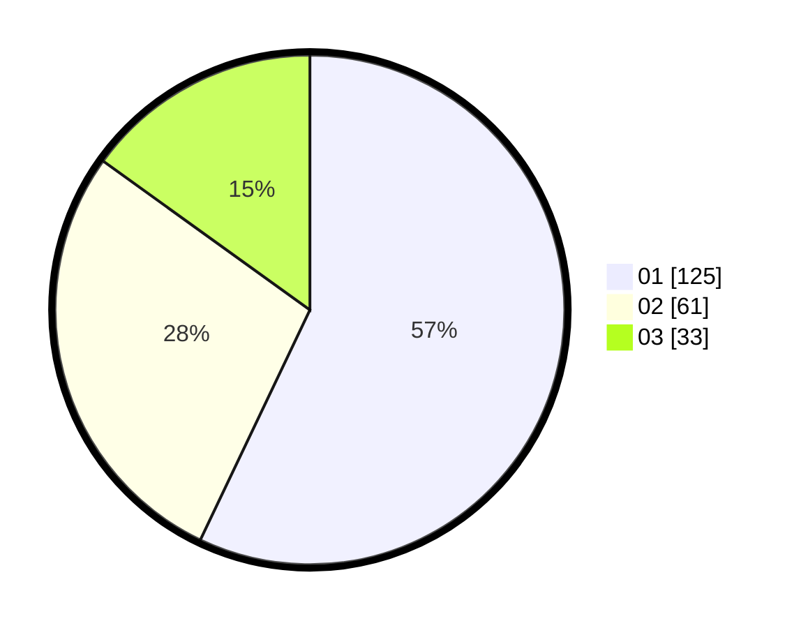

# Hasil

Hasil perolehan suara paslon dapat dilihat pada file paslon-01.txt, paslon-02.txt, dan paslon-03.txt.

Jika tidak ada, artinya data tersebut belum ada pada SIREKAP.

## Perolehan Suara

 * Paslon 01: **125**.
 * Paslon 02: **61**.
 * Paslon 03: **33**.

## Foto C Plano

https://sirekap-obj-formc.kpu.go.id/f907/pemilu/ppwp/31/73/05/10/03/3173051003092-20240215-013927--c2852576-98ad-48e1-8d8c-beea926c805b.jpg

https://sirekap-obj-formc.kpu.go.id/f907/pemilu/ppwp/31/73/05/10/03/3173051003092-20240215-014049--030e63b5-1499-49e6-893c-b3d2e87a64d0.jpg

https://sirekap-obj-formc.kpu.go.id/f907/pemilu/ppwp/31/73/05/10/03/3173051003092-20240215-014134--1227e7b1-4151-44df-8496-c6893dfd0550.jpg
